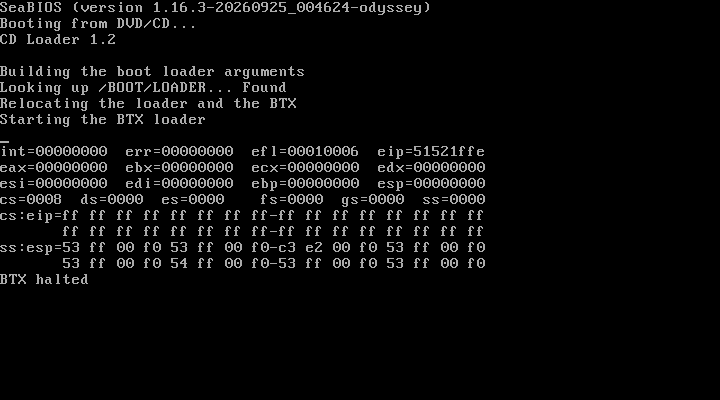

# FreeBSD 14.5 boot investigation (worktree C)

Worktree `/home/ruiu/sail-x86-os3`, branch `os-boot-c`, starting commit
`365a211`. Original ISO `/home/ruiu/os-images/FreeBSD-14.5-RELEASE-amd64-disc1.iso`
is attached read-only. All attempts use `build/llvm/sail-x86-system`, rebuilt
with `system-emu/build-llvm.sh` after each implementation change, and the
provided `build/bios.bin` / `build/vgabios.bin`.

`docs/os-boot-task.md` was absent in this worktree; the copy in
`/home/ruiu/sail-x86-os/docs/os-boot-task.md` was read without modification.
No virtual-8086 implementation or KVM harness changes are part of this work.
The virtual-8086 explanation in the earlier results is incorrect for this BTX.

## Diagnosis: relocation succeeds, interrupt stack cache is stale

Extracted the exact `/boot/loader` and `/boot/cdboot` files with:

```sh
mkdir -p build/os-boot/freebsd-files
xorriso -osirrox on -indev /home/ruiu/os-images/FreeBSD-14.5-RELEASE-amd64-disc1.iso \
  -extract /boot/loader build/os-boot/freebsd-files/loader \
  -extract /boot/cdboot build/os-boot/freebsd-files/cdboot
```

Before relocation (5,810,575 instructions, `0018:7d04`), all 454,656 bytes
at RAM `0x9000` match the extracted loader. Both SHA-256 values are
`6287f9b1cefdeea0d7ff5471a4f21f4a343e104db66dfbfa4fe5eb5c63b8d817`.
After relocation, all 450,560 payload bytes at `0x200000` match file offsets
`0x1000` onward: SHA-256
`403d1c8a0c4425c43d87ccf342aa333678540dd94d12ca7b1bf1fa6c8462d840`.
Thus neither ATAPI reads, A20, nor the relocation copy corrupts the loader.

The STEP=1 relocation trace shows `REP MOVSB` at `0000:7d6c`
(instruction 5,810,605) correctly writes the client stub from `0x7f20`
to `0xa000`, despite upper ESI bits surviving from protected mode.
`STOSD` at `0000:7d7c` (5,810,611) correctly writes `0x200000` to `0xa118`.
The six boot argument dwords at `0xa100` also match their source at `0x900`.
The client starts at instruction 5,818,768, `002b:00000000` with base `0xa000`.
Its reads and pushes are correct, including the entry value at stack address
`0x9ebe4`. The entry word at `0xa118` remains correct even after the crash.

At instruction 5,818,793 the client's `INT 0x30` switches from CPL 3 to 0.
`deliver_exception_inner_32` wrote only visible SS (`0x33` to `0x10`), leaving
its cached base at `0xa000`. The interrupt frame itself was written at
`0x17ec`, but BTX's `ADD EAX,[ESP+12]` at `0008:9401` (5,818,805)
reads `0xb7f8` instead of saved ESP at `0x17f8`, obtaining zero. Its next
`POP EAX` reads `0x14004` instead of the client entry on its stack and
obtains `0x51521ffe`. `CALL EAX` then faults. Exception entry at instruction
5,818,809 is the **first wrong write to the client stub**: the exception flags
`0x00010006` overwrite `0xa000`, changing the first byte `be` to `06`.
This corruption is a consequence of the bad interrupt stack cache, not the
cause of the original failure.

Commit `b6bb62e` reloads the SS descriptor cache on the protected-mode interrupt
stack switch. The guest-instruction regression enters `INT 0x30` from
ring 3 with SS base `0xa000`, checks the new SS base/limit/DPL, reads the
saved ESP through SS, executes a stack push/pop, and returns with IRETD.
It fails on the original binary with cached base `0xa000` instead of zero.
All 17 exception tests pass after rebuilding with sail-llvm.

SDM text checked before editing the model:
`/tmp/claude-1000/-home-ruiu-papers-sail-x86/93122f0a-0514-47a5-9dbe-2d1377a6b02e/scratchpad/sdm/sdm-090.txt`.
Revision 090 numbers the relevant sections Vol.3A **3.4.3** (visible and
hidden segment register state, including implicit INT loads), **7.12.1**
(interrupt stack switching), and **12.9.1–12.9.2** (mode transitions).
No change to mode switching or real-mode segment loads was needed.



## Attempts

Each attempt retains `.json`, `.stderr`, `.serial`, `.ram`, and `.png`
under `build/os-boot`. Trace limits stop before the named instruction runs.
All seven initial diagnostics have **no serial output**, exit status 0,
and stop at their configured trace bounds. Address-triggered dumps are
intermediate snapshots; the final dump replaces the same RAM/PNG files.

### freebsd-c-01

Reproduces BTX halted with eip=51521ffe.

```sh
SAIL_X86_BIOS_DEBUG=1 SAIL_X86_TRACE_START=5800000 SAIL_X86_TRACE_END=6110000 SAIL_X86_TRACE_STEP=5000 \
  python3 system-emu/run-boot.py --name freebsd-c-01 --timeout 180 -- build/llvm/sail-x86-system -ips 4 -kbd -b build/bios.bin -cdrom /home/ruiu/os-images/FreeBSD-14.5-RELEASE-amd64-disc1.iso -boot d
```

Wall: **1.201 s**. Instructions: **6,110,000**.

[PNG at stop](os-boot/freebsd-c-01.png).

### freebsd-c-02

Proves the entry word at 0xa118 is written correctly.

```sh
SAIL_X86_TRACE_PHYS_WRITE=0xa118 SAIL_X86_TRACE_ADDRESS=0x7d7c SAIL_X86_TRACE_START=6100000 SAIL_X86_TRACE_END=6110000 SAIL_X86_TRACE_STEP=10000 \
  python3 system-emu/run-boot.py --name freebsd-c-02 --timeout 120 -- build/llvm/sail-x86-system -ips 4 -kbd -b build/bios.bin -cdrom /home/ruiu/os-images/FreeBSD-14.5-RELEASE-amd64-disc1.iso -boot d
```

Wall: **1.601 s**. Instructions: **6,110,000**.

[PNG at stop](os-boot/freebsd-c-05.png).

[PNG at stop](os-boot/freebsd-c-02.png).

### freebsd-c-03

Locates the start of relocation at instruction 5,810,566.

```sh
SAIL_X86_TRACE_ADDRESS=0x7ce9 SAIL_X86_TRACE_START=6110000 SAIL_X86_TRACE_END=6110000 SAIL_X86_TRACE_STEP=1 \
  python3 system-emu/run-boot.py --name freebsd-c-03 --timeout 120 -- build/llvm/sail-x86-system -ips 4 -kbd -b build/bios.bin -cdrom /home/ruiu/os-images/FreeBSD-14.5-RELEASE-amd64-disc1.iso -boot d
```

Wall: **3.203 s**. Instructions: **6,110,000**.

[PNG at stop](os-boot/freebsd-c-03.png).

### freebsd-c-04

STEP=1 across mode changes and client stub/argument copies; stops during the following BIOS printing.

```sh
SAIL_X86_TRACE_PHYS_WRITE=0xa000 SAIL_X86_TRACE_ADDRESS=0xa000 SAIL_X86_TRACE_START=5810585 SAIL_X86_TRACE_END=5810800 SAIL_X86_TRACE_STEP=1 \
  python3 system-emu/run-boot.py --name freebsd-c-04 --timeout 120 -- build/llvm/sail-x86-system -ips 4 -kbd -b build/bios.bin -cdrom /home/ruiu/os-images/FreeBSD-14.5-RELEASE-amd64-disc1.iso -boot d
```

Wall: **1.201 s**. Instructions: **5,810,800**.

[PNG at stop](os-boot/freebsd-c-04.png).

### freebsd-c-05

Locates client entry at 5,818,768 and the later bad write to 0xa000.

```sh
SAIL_X86_TRACE_PHYS_WRITE=0xa000 SAIL_X86_TRACE_ADDRESS=0xa000 SAIL_X86_TRACE_START=6110000 SAIL_X86_TRACE_END=6110000 SAIL_X86_TRACE_STEP=1 \
  python3 system-emu/run-boot.py --name freebsd-c-05 --timeout 120 -- build/llvm/sail-x86-system -ips 4 -kbd -b build/bios.bin -cdrom /home/ruiu/os-images/FreeBSD-14.5-RELEASE-amd64-disc1.iso -boot d
```

Wall: **1.601 s**. Instructions: **6,110,000**.

### freebsd-c-06

Full pre-relocation loader comparison: zero mismatches.

```sh
SAIL_X86_TRACE_START=5810575 SAIL_X86_TRACE_END=5810575 SAIL_X86_TRACE_STEP=1 \
  python3 system-emu/run-boot.py --name freebsd-c-06 --timeout 120 -- build/llvm/sail-x86-system -ips 4 -kbd -b build/bios.bin -cdrom /home/ruiu/os-images/FreeBSD-14.5-RELEASE-amd64-disc1.iso -boot d
```

Wall: **1.201 s**. Instructions: **5,810,575**.

[PNG at stop](os-boot/freebsd-c-06.png).

### freebsd-c-07

STEP=1 through the client syscall and bad SS-relative reads; stops while BTX formats its exception screen.

```sh
SAIL_X86_TRACE_PHYS_WRITE=0xa000 SAIL_X86_TRACE_START=5818760 SAIL_X86_TRACE_END=5818850 SAIL_X86_TRACE_STEP=1 \
  python3 system-emu/run-boot.py --name freebsd-c-07 --timeout 120 -- build/llvm/sail-x86-system -ips 4 -kbd -b build/bios.bin -cdrom /home/ruiu/os-images/FreeBSD-14.5-RELEASE-amd64-disc1.iso -boot d
```

Wall: **1.201 s**. Instructions: **5,818,850**.

[PNG at stop](os-boot/freebsd-c-07.png).

## Validation of the SS cache fix

Rebuilt with `system-emu/build-llvm.sh`. Compiled the system tests against
the same generated LLVM model object and runtime, using clang++ with
`-std=c++20 -O2 -march=native`. All **15 system/device/PNG suites** pass,
including 17 exception cases and the new INT/IRETD regression.
Build/run commands are retained in `build/llvm/check-system.py`; per-suite
logs are in `build/llvm/test-*.log`, with the aggregate in
`build/os-boot/system-tests-ss-cache.log`.

### freebsd-c-08

After the fix, reaches BTX loader 1.00 / BTX 1.02, the video/keyboard console banner, and BIOS CD detection. Stopped at the trace bound.

```sh
SAIL_X86_TRACE_START=5818794 SAIL_X86_TRACE_END=10000000 SAIL_X86_TRACE_STEP=1000000 python3 system-emu/run-boot.py --name freebsd-c-08 --timeout 120 -- build/llvm/sail-x86-system -ips 4 -kbd -b build/bios.bin -cdrom /home/ruiu/os-images/FreeBSD-14.5-RELEASE-amd64-disc1.iso -boot d
```

Wall: **1.801 s**. Instructions: **10,000,000**. Exit: **0**.
Serial: no output. [PNG at stop](os-boot/freebsd-c-08.png).

### freebsd-c-09

Reaches the FreeBSD installer menu and escapes to the `OK` loader prompt. Sending the entire console command at once overfills the BIOS keyboard buffer: only `set console=co` appears. Stopped manually with SIGUSR1 followed by SIGTERM; retry uses small input chunks.

```sh
python3 system-emu/run-boot.py --name freebsd-c-09 --timeout 90 --send 8:3 --send '10:set console=comconsole\n' --send '13:\x01sboot -s\n' -- build/llvm/sail-x86-system -ips 4 -kbd -b build/bios.bin -cdrom /home/ruiu/os-images/FreeBSD-14.5-RELEASE-amd64-disc1.iso -boot d
```

Wall: **69.429 s**. Instructions: **387,826,281**. Exit: **0**.
Serial: no output. [PNG at stop](os-boot/freebsd-c-09.png).

