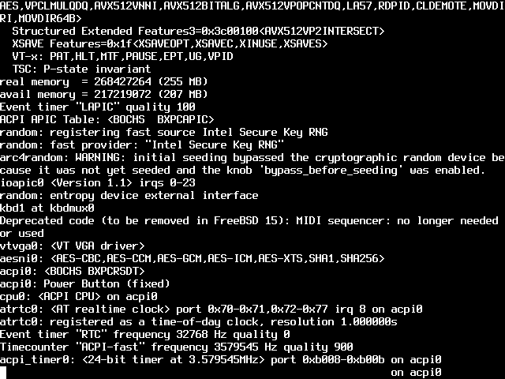
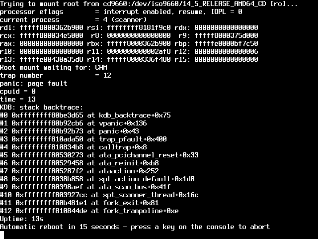
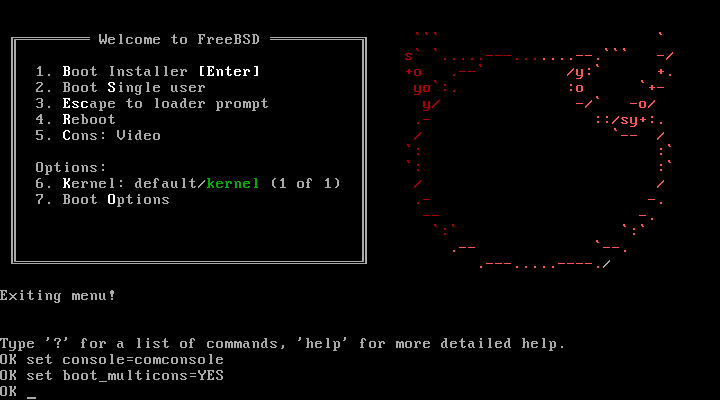
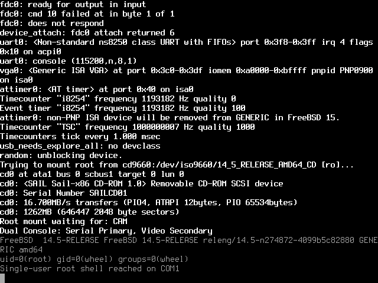

# FreeBSD 14.5 boot investigation (worktree C)

Worktree `/home/ruiu/sail-x86-os3`, branch `os-boot-c`, starting commit
`365a211`. Original ISO `/home/ruiu/os-images/FreeBSD-14.5-RELEASE-amd64-disc1.iso`
is attached read-only. All attempts use `build/llvm/sail-x86-system`, rebuilt
with `system-emu/build-llvm.sh` after each implementation change, and the
provided `build/bios.bin` / `build/vgabios.bin`.

**Result:** FreeBSD 14.5-RELEASE boots to a single-user root shell on
COM1. `uname -a`, `id`, and `mount` confirm the release, UID 0, and the
original CD mounted read-only as `/`. See the final status table below.

`docs/os-boot-task.md` was absent in this worktree; the copy in
`/home/ruiu/sail-x86-os/docs/os-boot-task.md` was read without modification.
No virtual-8086 implementation or KVM harness changes are part of this work.
The virtual-8086 explanation in the earlier results is incorrect for this BTX.

## Diagnosis: relocation succeeds, interrupt stack cache is stale

Extracted the exact `/boot/loader` and `/boot/cdboot` files with:

```sh
mkdir -p build/os-boot/freebsd-files
xorriso -osirrox on -indev /home/ruiu/os-images/FreeBSD-14.5-RELEASE-amd64-disc1.iso \
  -extract /boot/loader build/os-boot/freebsd-files/loader \
  -extract /boot/cdboot build/os-boot/freebsd-files/cdboot
```

Before relocation (5,810,575 instructions, `0018:7d04`), all 454,656 bytes
at RAM `0x9000` match the extracted loader. Both SHA-256 values are
`6287f9b1cefdeea0d7ff5471a4f21f4a343e104db66dfbfa4fe5eb5c63b8d817`.
After relocation, all 450,560 payload bytes at `0x200000` match file offsets
`0x1000` onward: SHA-256
`403d1c8a0c4425c43d87ccf342aa333678540dd94d12ca7b1bf1fa6c8462d840`.
Thus neither ATAPI reads, A20, nor the relocation copy corrupts the loader.
These comparisons can be reproduced against the retained snapshots:

```python
from pathlib import Path
p = Path("build/os-boot")
loader = (p / "freebsd-files/loader").read_bytes()
for name, address, expected in [
    ("freebsd-c-06", 0x9000, loader),
    ("freebsd-c-04", 0x200000, loader[0x1000:]),
]:
    with (p / (name + ".ram")).open("rb") as ram:
        ram.seek(address)
        assert ram.read(len(expected)) == expected
```

In both the post-copy snapshot (`freebsd-c-04`) and post-fault snapshot
(`freebsd-c-07`), the dwords at client offsets `0x114`/`0x118` are
`0x00000000`/`0x00200000`. The original suspicion that these two words were
corrupt is not borne out by the RAM dumps.

The STEP=1 relocation trace shows `REP MOVSB` at `0000:7d6c`
(instruction 5,810,605) correctly writes the client stub from `0x7f20`
to `0xa000`, despite upper ESI bits surviving from protected mode.
`STOSD` at `0000:7d7c` (5,810,611) correctly writes `0x200000` to `0xa118`.
The six boot argument dwords at `0xa100` also match their source at `0x900`.
The client starts at instruction 5,818,768, `002b:00000000` with base `0xa000`.
Its reads and pushes are correct, including the entry value at stack address
`0x9ebe4`. The entry word at `0xa118` remains correct even after the crash.

At instruction 5,818,793 the client's `INT 0x30` switches from CPL 3 to 0.
`deliver_exception_inner_32` wrote only visible SS (`0x33` to `0x10`), leaving
its cached base at `0xa000`. The interrupt frame itself was written at
`0x17ec`, but BTX's `ADD EAX,[ESP+12]` at `0008:9401` (5,818,805)
reads `0xb7f8` instead of saved ESP at `0x17f8`, obtaining zero. Its next
`POP EAX` reads `0x14004` instead of the client entry on its stack and
obtains `0x51521ffe`. `CALL EAX` then faults. Exception entry at instruction
5,818,809 is the **first wrong write to the client stub**: the exception flags
`0x00010006` overwrite `0xa000`, changing the first byte `be` to `06`.
This corruption is a consequence of the bad interrupt stack cache, not the
cause of the original failure.

Commit `b6bb62e` reloads the SS descriptor cache on the protected-mode interrupt
stack switch. The guest-instruction regression enters `INT 0x30` from
ring 3 with SS base `0xa000`, checks the new SS base/limit/DPL, reads the
saved ESP through SS, executes a stack push/pop, and returns with IRETD.
It fails on the original binary with cached base `0xa000` instead of zero.
All 17 exception tests pass after rebuilding with sail-llvm.

SDM text checked before editing the model:
`/tmp/claude-1000/-home-ruiu-papers-sail-x86/93122f0a-0514-47a5-9dbe-2d1377a6b02e/scratchpad/sdm/sdm-090.txt`.
Revision 090 numbers the relevant sections Vol.3A **3.4.3** (visible and
hidden segment register state, including implicit INT loads), **7.12.1**
(interrupt stack switching), and **12.9.1–12.9.2** (mode transitions).
No change to mode switching or real-mode segment loads was needed.


## Attempts

Each attempt retains `.json`, `.stderr`, `.serial`, `.ram`, and `.png`
under `build/os-boot`. Trace limits stop before the named instruction runs.
All seven initial diagnostics have **no serial output**, exit status 0,
and stop at their configured trace bounds. Address-triggered dumps are
intermediate snapshots; the final dump replaces the same RAM/PNG files.

### freebsd-c-01

Reproduces BTX halted with eip=51521ffe.

```sh
SAIL_X86_BIOS_DEBUG=1 SAIL_X86_TRACE_START=5800000 SAIL_X86_TRACE_END=6110000 SAIL_X86_TRACE_STEP=5000 \
  python3 system-emu/run-boot.py --name freebsd-c-01 --timeout 180 -- build/llvm/sail-x86-system -ips 4 -kbd -b build/bios.bin -cdrom /home/ruiu/os-images/FreeBSD-14.5-RELEASE-amd64-disc1.iso -boot d
```

Wall: **1.201 s**. Instructions: **6,110,000**.

[PNG at stop](os-boot/freebsd-c-01.png).

### freebsd-c-02

Proves the entry word at 0xa118 is written correctly.

```sh
SAIL_X86_TRACE_PHYS_WRITE=0xa118 SAIL_X86_TRACE_ADDRESS=0x7d7c SAIL_X86_TRACE_START=6100000 SAIL_X86_TRACE_END=6110000 SAIL_X86_TRACE_STEP=10000 \
  python3 system-emu/run-boot.py --name freebsd-c-02 --timeout 120 -- build/llvm/sail-x86-system -ips 4 -kbd -b build/bios.bin -cdrom /home/ruiu/os-images/FreeBSD-14.5-RELEASE-amd64-disc1.iso -boot d
```

Wall: **1.601 s**. Instructions: **6,110,000**.

[PNG at stop](os-boot/freebsd-c-02.png).

### freebsd-c-03

Locates the start of relocation at instruction 5,810,566.

```sh
SAIL_X86_TRACE_ADDRESS=0x7ce9 SAIL_X86_TRACE_START=6110000 SAIL_X86_TRACE_END=6110000 SAIL_X86_TRACE_STEP=1 \
  python3 system-emu/run-boot.py --name freebsd-c-03 --timeout 120 -- build/llvm/sail-x86-system -ips 4 -kbd -b build/bios.bin -cdrom /home/ruiu/os-images/FreeBSD-14.5-RELEASE-amd64-disc1.iso -boot d
```

Wall: **3.203 s**. Instructions: **6,110,000**.

[PNG at stop](os-boot/freebsd-c-03.png).

### freebsd-c-04

STEP=1 across mode changes and client stub/argument copies; stops during the following BIOS printing.

```sh
SAIL_X86_TRACE_PHYS_WRITE=0xa000 SAIL_X86_TRACE_ADDRESS=0xa000 SAIL_X86_TRACE_START=5810585 SAIL_X86_TRACE_END=5810800 SAIL_X86_TRACE_STEP=1 \
  python3 system-emu/run-boot.py --name freebsd-c-04 --timeout 120 -- build/llvm/sail-x86-system -ips 4 -kbd -b build/bios.bin -cdrom /home/ruiu/os-images/FreeBSD-14.5-RELEASE-amd64-disc1.iso -boot d
```

Wall: **1.201 s**. Instructions: **5,810,800**.

[PNG at stop](os-boot/freebsd-c-04.png).

### freebsd-c-05

Locates client entry at 5,818,768 and the later bad write to 0xa000.

```sh
SAIL_X86_TRACE_PHYS_WRITE=0xa000 SAIL_X86_TRACE_ADDRESS=0xa000 SAIL_X86_TRACE_START=6110000 SAIL_X86_TRACE_END=6110000 SAIL_X86_TRACE_STEP=1 \
  python3 system-emu/run-boot.py --name freebsd-c-05 --timeout 120 -- build/llvm/sail-x86-system -ips 4 -kbd -b build/bios.bin -cdrom /home/ruiu/os-images/FreeBSD-14.5-RELEASE-amd64-disc1.iso -boot d
```

Wall: **1.601 s**. Instructions: **6,110,000**.

[PNG at stop](os-boot/freebsd-c-05.png).

### freebsd-c-06

Full pre-relocation loader comparison: zero mismatches.

```sh
SAIL_X86_TRACE_START=5810575 SAIL_X86_TRACE_END=5810575 SAIL_X86_TRACE_STEP=1 \
  python3 system-emu/run-boot.py --name freebsd-c-06 --timeout 120 -- build/llvm/sail-x86-system -ips 4 -kbd -b build/bios.bin -cdrom /home/ruiu/os-images/FreeBSD-14.5-RELEASE-amd64-disc1.iso -boot d
```

Wall: **1.201 s**. Instructions: **5,810,575**.

[PNG at stop](os-boot/freebsd-c-06.png).

### freebsd-c-07

STEP=1 through the client syscall and bad SS-relative reads; stops while BTX formats its exception screen.

```sh
SAIL_X86_TRACE_PHYS_WRITE=0xa000 SAIL_X86_TRACE_START=5818760 SAIL_X86_TRACE_END=5818850 SAIL_X86_TRACE_STEP=1 \
  python3 system-emu/run-boot.py --name freebsd-c-07 --timeout 120 -- build/llvm/sail-x86-system -ips 4 -kbd -b build/bios.bin -cdrom /home/ruiu/os-images/FreeBSD-14.5-RELEASE-amd64-disc1.iso -boot d
```

Wall: **1.201 s**. Instructions: **5,818,850**.

[PNG at stop](os-boot/freebsd-c-07.png).

## Validation of the SS cache fix

Rebuilt with `system-emu/build-llvm.sh`. Compiled the system tests against
the same generated LLVM model object and runtime, using clang++ with
`-std=c++20 -O2 -march=native`. All **15 system/device/PNG suites** pass,
including 17 exception cases and the new INT/IRETD regression.
Build/run commands are retained in `build/llvm/check-system.py`; per-suite
logs are in `build/llvm/test-*.log`, with the aggregate in
`build/os-boot/system-tests-ss-cache.log`.

### freebsd-c-08

After the fix, reaches BTX loader 1.00 / BTX 1.02, the video/keyboard console banner, and BIOS CD detection. Stopped at the trace bound.

```sh
SAIL_X86_TRACE_START=5818794 SAIL_X86_TRACE_END=10000000 SAIL_X86_TRACE_STEP=1000000 python3 system-emu/run-boot.py --name freebsd-c-08 --timeout 120 -- build/llvm/sail-x86-system -ips 4 -kbd -b build/bios.bin -cdrom /home/ruiu/os-images/FreeBSD-14.5-RELEASE-amd64-disc1.iso -boot d
```

Wall: **1.801 s**. Instructions: **10,000,000**. Exit: **0**.
Serial: no output. [PNG at stop](os-boot/freebsd-c-08.png).

### freebsd-c-09

Reaches the FreeBSD installer menu and escapes to the `OK` loader prompt. Sending the entire console command at once overfills the BIOS keyboard buffer: only `set console=co` appears. Stopped manually with SIGUSR1 followed by SIGTERM; retry uses small input chunks.

```sh
python3 system-emu/run-boot.py --name freebsd-c-09 --timeout 90 --send 8:3 --send '10:set console=comconsole\n' --send '13:\x01sboot -s\n' -- build/llvm/sail-x86-system -ips 4 -kbd -b build/bios.bin -cdrom /home/ruiu/os-images/FreeBSD-14.5-RELEASE-amd64-disc1.iso -boot d
```

Wall: **69.429 s**. Instructions: **387,826,281**. Exit: **0**.
Serial: no output. [PNG at stop](os-boot/freebsd-c-09.png).

### freebsd-c-10

Reached the serial `OK` prompt and accepted `boot -s`. Timed out while
loading the kernel's third ELF segment; no kernel execution yet. The VGA
capture still shows the loader because only `comconsole` was active.
The initial scheduled input again arrived before the prompt was ready.

```sh
python3 system-emu/run-boot.py --name freebsd-c-10 --timeout 180 --send 8:3 --send '10:set ' --send 11:console --send 12:=com --send '13:console\n' --send '16:\x01sboot -s\n' -- build/llvm/sail-x86-system -ips 4 -kbd -b build/bios.bin -cdrom /home/ruiu/os-images/FreeBSD-14.5-RELEASE-amd64-disc1.iso -boot d
```

Additional input sent through the emulator's stdin pipe:

- 2026-09-24 22:02:07 UTC: `\x01kmconsole\n\x01s` to finish the truncated keyboard command and select serial input.
- 2026-09-24 22:02:35 UTC: `boot -s\n` after observing serial `OK`.

The exact supplementary input is also in
`build/os-boot/freebsd-c-10-extra-input.json`.

Wall: **180.38 s**. Instructions: **1,039,870,498**.
Stop: **timeout**, exit **0**. [PNG at stop](os-boot/freebsd-c-10.png).

Last serial output (spinner updates omitted):

```text
OK boot -s
Loading kernel...
/boot/kernel/kernel text=0x183380 text=0xe00214 text=0x43fadb
```

### freebsd-c-11

Scheduled input now reaches the serial prompt without supplementary commands.
The ISO's `/boot/defaults/loader.conf` documents comma/space-separated
`console` names and `boot_multicons`; enabling both serial and video gives
a 640x480 VGA rendering of the kernel console.

```sh
python3 system-emu/run-boot.py --name freebsd-c-11 --timeout 900 --send 35:3 --send '40:set ' --send 42:console --send 44:=com --send '46:console\n' --send '50:\x01sset console="comconsole,vidconsole"\n' --send '53:set boot_multicons=YES\n' --send '56:boot -s\n' -- build/llvm/sail-x86-system -ips 4 -kbd -b build/bios.bin -cdrom /home/ruiu/os-images/FreeBSD-14.5-RELEASE-amd64-disc1.iso -boot d
```

Reached the FreeBSD 14.5 GENERIC amd64 kernel, LAPIC timer, IOAPIC, ACPI,
PCI, ATA channels, and root-mount preparation. Then panicked in
`ata_pci_dmareset+0x20` (`0xffffffff8052fb60`), reading through a NULL
bus-master register resource (`fault virtual address = 0x10`). This is
independent of the fixed BTX issue. The emulator advertised a PIIX3
bus-master interface but BAR4 was absent, so allocation failed. FreeBSD
installs a DMA-reset callback even when the attached drives use PIO.

Wall: **308.935 s**. Last captured count before reboot:
**1,443,914,294** instructions. The guest's automatic reboot reset the
counter; the final post-reboot count is **103,071,220**.
Stopped manually after that reboot, exit **0**. An attempted
serial space to cancel reboot arrived too late.
[Final post-reboot PNG](os-boot/freebsd-c-11.png).





Last serial output:

```text
Trying to mount root from cd9660:/dev/iso9660/14_5_RELEASE_AMD64_CD [ro]...
Root mount waiting for: CAM
panic: page fault
#5 0xffffffff80530273 at ata_pcichannel_reset+0x33
#6 0xffffffff80529458 at ata_reinit+0xb8
#7 0xffffffff805287f2 at ataaction+0x252
#8 0xffffffff8038b858 at xpt_action_default+0x1d8
#9 0xffffffff80398aef at ata_scan_bus+0x41f
#10 0xffffffff803927cc at xpt_scanner_thread+0x16c
Uptime: 13s
Automatic reboot in 15 seconds - press a key on the console to abort
Rebooting...
```

The diagnosis uses the unmodified kernel's symbols/disassembly and
[FreeBSD 14.5 ata-pci.c](https://github.com/freebsd/freebsd-src/blob/releng/14.5/sys/dev/ata/ata-pci.c),
especially `ata_pci_attach`, `ata_pci_ch_attach`, and `ata_pci_dmareset`.
The register implementation follows Intel's
[82371FB/82371SB datasheet](https://www.mouser.com/catalog/specsheets/intel%20corporation_29055002.pdf),
§2.3.9 (BMIBA) and §§2.7.1–2.7.3 (command/status/PRD pointer).
Attached ATA/ATAPI devices remain PIO-only: DMA transfer execution is
still outside this platform's supported device capabilities.


### freebsd-c-12

First bus-master BAR implementation, with the physical PIIX3 16-bit address mask. SeaBIOS stops before video initialization.

```sh
system-emu/run-boot.py --name freebsd-c-12 --timeout 900 --expect panic: --send 35:3 --send '40:set ' --send 42:console --send 44:=com --send '46:console\n' --send '50:\x01sset console="comconsole,vidconsole"\n' --send '53:set boot_multicons=YES\n' --send '56:boot -s\n' -- build/llvm/sail-x86-system -ips 4 -kbd -b build/bios.bin -cdrom /home/ruiu/os-images/FreeBSD-14.5-RELEASE-amd64-disc1.iso -boot d
```

Wall: **0.401 s**. Instructions: **126,558**.
Stop: **exit**, exit **1**.
[PNG at stop (video not initialized)](os-boot/freebsd-c-12.png).

### freebsd-c-13

Same implementation with firmware debug enabled: `PCI: out of I/O address space`. The QEMU-targeted SeaBIOS PCI allocator sizes an I/O BAR with a 32-bit complement, so `0x0000fff1` appears almost 4 GiB wide.

```sh
SAIL_X86_BIOS_DEBUG=1 system-emu/run-boot.py --name freebsd-c-13 --timeout 30 -- build/llvm/sail-x86-system -ips 4 -kbd -b build/bios.bin -cdrom /home/ruiu/os-images/FreeBSD-14.5-RELEASE-amd64-disc1.iso -boot d
```

Wall: **0.602 s**. Instructions: **126,997**.
Stop: **exit**, exit **1**.
[PNG at stop (video not initialized)](os-boot/freebsd-c-13.png).

The final device implementation uses the same 32-bit, 16-byte I/O BAR
as [QEMU's PIIX IDE device](https://github.com/qemu/qemu/blob/master/hw/ide/piix.c)
(`bmdma_setup_bar`, `pci_register_bar`) and
[PCI BAR registration](https://github.com/qemu/qemu/blob/master/hw/pci/pci.c)
(`wmask = ~(size - 1)`). Addresses above the 16-bit x86 port space do not
decode; they do not alias low ports. The register layout and interrupt
acknowledgement follow Intel's datasheet. This is a virtual-device BAR
compatibility choice, not a Sail instruction-model change. Tests cover
firmware size probing, relocation/enable gating, actual port dispatch,
per-channel command/status/PRD state, and PIO interrupt latching/W1C.

Commit `19a5680` contains this device fix and the three regression groups.
After rebuilding, all **15 system/device/PNG suites** pass again
(`build/os-boot/system-tests-ide-bar32.log`), including 63 basic platform
checks, 17 exception tests, and 5 IDE channel tests.



### freebsd-c-14

With both committed fixes, the kernel discovers `cd0` at ata1 and mounts the disc. It reaches `/sbin/init` in ring 3, but init loops inside its static libc `__sfvwrite` before the single-user prompt. Two snapshots find RIP `0x27128b`/`0x27128d` with an implausibly large iovec length `0x2100000000`. Stopped manually to inspect the RAM and disassembly.

```sh
system-emu/run-boot.py --name freebsd-c-14 --timeout 900 --expect panic: --send 35:3 --send '40:set ' --send 42:console --send 44:=com --send '46:console\n' --send '50:\x01sset console="comconsole,vidconsole"\n' --send '53:set boot_multicons=YES\n' --send '56:boot -s\n' -- build/llvm/sail-x86-system -ips 4 -kbd -b build/bios.bin -cdrom /home/ruiu/os-images/FreeBSD-14.5-RELEASE-amd64-disc1.iso -boot d
```

Wall: **429.36 s**. Instructions: **2,107,467,776**.
Stop: **manual SIGTERM**, exit **0**.
[PNG at stop](os-boot/freebsd-c-14.png).

### freebsd-c-15

Address-triggered snapshot at init's first `__sfvwrite` (`0x271000`),
**1,357,423,061** instructions. The requested output is the 19-byte literal
`init(8) starting...`; the iovec's base is correct (`0x200500`), but its
length is `0x2f2f2f2f`. The adjacent residual count is correctly 19.
Stopped by a watcher as soon as the address-triggered RAM dump completed.
The watcher sent SIGTERM directly, preserving that snapshot.

```sh
SAIL_X86_TRACE_ADDRESS=0x271000 system-emu/run-boot.py --name freebsd-c-15 --timeout 600 --send 35:3 --send '40:set ' --send 42:console --send 44:=com --send '46:console\n' --send '50:\x01sset console="comconsole,vidconsole"\n' --send '53:set boot_multicons=YES\n' --send '56:boot -s\n' -- build/llvm/sail-x86-system -ips 4 -kbd -b build/bios.bin -cdrom /home/ruiu/os-images/FreeBSD-14.5-RELEASE-amd64-disc1.iso -boot d
```

Wall: **262.291 s**. Final instruction count: **1,358,354,364**.
Stop: **manual SIGTERM after address snapshot**, exit **0**.
[PNG at stop](os-boot/freebsd-c-15.png).

A separate replay of init's formatting routine from the previous RAM dump
finishes correctly when all accessed pages are already present. All present
read-only pages of the original init image also match the ISO: **81,920**
rodata bytes and **225,616** code bytes checked, zero mismatches. This rules
out a damaged `/sbin/init` image and directs attention to demand paging.

Commit `e019202` adds `SAIL_X86_TRACE_ADDRESS_STEPS=N`: begin STEP=1 at a
code address and stop after N steps, retaining registers/RAM/PNG. The
SeaBIOS regression `system-emu/tests/boot-ud.py` checks the exact counts and
stop; it passes with `BOOT_SMOKE_EMULATOR=build/llvm/sail-x86-system`.

### freebsd-c-16

STEP=1 at init's `MOVABS R12,0x100000000`, address `0x273ffd`.
The immediate begins at `0x273fff` and crosses into a non-present page.
This run uses the old memory-access implementation and the new address
window tool; the subsequent fixed binary was built while this process
continued executing its original mapped executable.

```sh
SAIL_X86_TRACE_ADDRESS=0x273ffd SAIL_X86_TRACE_ADDRESS_STEPS=24 system-emu/run-boot.py --name freebsd-c-16 --timeout 600 --send 35:3 --send '40:set ' --send 42:console --send 44:=com --send '46:console\n' --send '50:\x01sset console="comconsole,vidconsole"\n' --send '53:set boot_multicons=YES\n' --send '56:boot -s\n' -- build/llvm/sail-x86-system -ips 4 -kbd -b build/bios.bin -cdrom /home/ruiu/os-images/FreeBSD-14.5-RELEASE-amd64-disc1.iso -boot d
```

| Instruction count | RIP | R12 | CR2 | Observation |
|---|---|---|---|---|
| 1,355,844,793 | `0x273ffd` | `0x31cfc0` | `0x2651a0` | Before MOVABS |
| 1,355,844,794 | `0x274007` | `0x5353535353535300` | `0x274006` | MOVABS incorrectly retires with garbage |
| 1,355,844,795 | `0xffffffff81083610` | `0x5353535353535300` | `0x274007` | Following instruction finally raises #PF |

The cross-page external helper repeatedly calls `translate_addr` through
a C++ compatibility adapter. On a fault, that adapter sets its legacy
exception state and returns, so the external byte loop continues reading
an invalid translation. The exception does not propagate back to the Sail
instruction. The next instruction fetch faults normally, leaving the
corrupted R12 constant in place. RAM byte zero is `0x53`; the failed
translations supplied that same byte for the seven missing immediate bytes.
The formatter adds R12 19 times and shifts right by 32:
`((0x5353535353535300 * 19) & 0xffffffffffffffff) >> 32 = 0x2f2f2f2f`.
Its store at `0x2740a2` therefore writes the observed bad iovec length.

Wall: **267.5 s**. Instructions: **1,355,844,817**.
Stop: **24-step trace bound**, exit **0**.
[PNG at stop](os-boot/freebsd-c-16.png).

Commit `db28366` validates each covered page inside Sail before entering the external
copy helper. Page faults then propagate normally, preserving the instruction
for restart; a failed store also leaves memory unchanged. The SDM text was
checked before editing: revision 090 Vol.3A §§7.5–7.6 and the Interrupt 14
entry, especially its “Program State Change” and CR2 descriptions.

The two new paging regression groups fail on the old implementation. The
minimal MOVABS reproducer originally advances RIP to `0x101007`, writes
R12=0, and reports no instruction fault even though CR2=`0x101006` and the
adapter's legacy exception flag is set. The fixed tests require #PF at
`0x100ffd`, CR2=`0x101000`, unchanged R12, and a successful retry after the
second page is mapped elsewhere in physical RAM. Data-read and data-write
cases check absent/read-only second pages and unchanged state before retry.
All **18 paging tests** and all **15 system/device/PNG suites** pass after
rebuilding (`build/os-boot/system-tests-cross-page.log`).

### freebsd-c-17

With the crossing-page fault fix, init passes its startup formatter but
repeatedly takes a user-mode #GP at `0x2d697f`, inside its allocator.
The kernel stack shows `trap → trapsignal → tdsendsignal`, with timer
interrupts nested over that path. The saved user trap frame identifies
`SHUFPD xmm0,[RIP-0xce5e8],2`. Its correct source is aligned address
`0x2083a0`; the model reads before consuming imm8 and instead checks
`0x20839f`, raising #GP. No single-user prompt yet.

```sh
system-emu/run-boot.py --name freebsd-c-17 --timeout 900 --expect panic: --send 35:3 --send '40:set ' --send 42:console --send 44:=com --send '46:console\n' --send '50:\x01sset console="comconsole,vidconsole"\n' --send '53:set boot_multicons=YES\n' --send '56:boot -s\n' -- build/llvm/sail-x86-system -ips 4 -kbd -b build/bios.bin -cdrom /home/ruiu/os-images/FreeBSD-14.5-RELEASE-amd64-disc1.iso -boot d
```

Wall: **543.004 s**. Instructions: **2,538,768,426**.
Stop: **manual SIGTERM after trap-frame diagnosis**, exit **0**.
[PNG at stop](os-boot/freebsd-c-17.png).

The relevant SDM text was checked before editing: Vol.2A §2.2.1.6 says
RIP-relative addressing adds the displacement to the next instruction's
RIP; Vol.2B's SHUFPD/SHUFPS entries specify the trailing imm8 operand.
The shared legacy shuffle decoder must fetch that byte before reading
its memory operand. The instruction regression exercises both shuffle
forms, positive/negative displacements, the selected output lanes, and
preservation of bits above XMM in the legacy encoding.

Commit `5f5277f` implements that decode-order fix. The new test fails with
#GP on the original implementation and passes afterward. All **64 basic
platform tests** and all **15 system/device/PNG suites** pass with the
rebuilt fast emulator (`build/os-boot/system-tests-shuffle-rip.log`).


### freebsd-c-18

The SHUFPD fix allows init to execute more user programs, but serial output
stops after root mounting and later reports `lo0: link state changed to UP`.
The RAM process list contains `init`, `sh` (PIDs 19 and 229), and `devd`
(PID 230). Kernel `boothowto` is `0x20001002`, including `RB_SINGLE`, so
`boot -s` was accepted. No `uart0` attachment appears in the kernel log.
FreeBSD init's `open_console()` falls back to `/dev/null` if opening the
console fails; an EOF then lets the single-user shell exit into startup
scripts. The absent UART attachment is consistent with that behavior.

```sh
system-emu/run-boot.py --name freebsd-c-18 --timeout 900 --expect '(?m)^FREEBSD_SINGLE_USER_OK\r?$|panic:' --send 35:3 --send '40:set ' --send 42:console --send 44:=com --send '46:console\n' --send '50:\x01sset console="comconsole,vidconsole"\n' --send '53:set boot_multicons=YES\n' --send '56:boot -s\n' -- build/llvm/sail-x86-system -ips 4 -kbd -b build/bios.bin -cdrom /home/ruiu/os-images/FreeBSD-14.5-RELEASE-amd64-disc1.iso -boot d
```

Wall: **602.747 s**. Instructions: **2,770,049,568**.
Stop: **manual SIGTERM after console diagnosis**, exit **0**.
The retained SIGUSR1 snapshot is at **2,246,036,213** instructions.
[PNG at stop](os-boot/freebsd-c-18.png).
The prompt watcher never sent any additional input.

SeaBIOS's built-in DSDT reads PCI function `00:01.3`, byte `0x67` bit 3
(`CAEN`), to implement `COM1._STA`. The platform initialized this byte to
zero even though COM1 exists at port `0x3f8`; ACPI consequently hid it.
The correction sets CAEN while leaving the absent COM2 disabled, matching
[QEMU's PIIX4 platform configuration](https://gitlab.com/qemu-project/qemu/-/blob/master/hw/acpi/piix4.c).
The corresponding firmware definitions were checked directly in the
SeaBIOS 1.16.3 source used by the other worktree (read-only):
`src/fw/acpi-dsdt.dsl` and `src/fw/acpi-dsdt-isa.dsl`.
Commit `a531d85` contains this correction. The PCI regression verifies the
two presence bits through config-space reads. It fails on the old device
model at the new assertion. After rebuilding the fast emulator, all **15
system/device/PNG suites** pass (`system-tests-com1-acpi.log`).


### freebsd-c-19

**Reached the single-user root shell on COM1.** The kernel now attaches
`uart0` at `0x3f8`, IRQ 4, and identifies it as the 115200-baud console.
It mounts the ISO, init prints the shell selection prompt, and a newline
starts `/bin/sh`. The shell runs `uname -a`, `id`, and `mount` successfully.

```sh
system-emu/run-boot.py --name freebsd-c-19 --timeout 900 --expect '(?m)^FREEBSD_SINGLE_USER_OK\r?$|panic:' --send 35:3 --send '40:set ' --send 42:console --send 44:=com --send '46:console\n' --send '50:\x01sset console="comconsole,vidconsole"\n' --send '53:set boot_multicons=YES\n' --send '56:boot -s\n' -- build/llvm/sail-x86-system -ips 4 -kbd -b build/bios.bin -cdrom /home/ruiu/os-images/FreeBSD-14.5-RELEASE-amd64-disc1.iso -boot d
```

Supplementary serial input, sent through the emulator stdin pipe after
matching each prompt:

- 2026-09-24 23:08:38.320 UTC: `\n`.
- 2026-09-24 23:08:52.825 UTC: `uname -a; id; mount; echo FREEBSD_SINGLE_USER_OK\n`.

The complete supplementary input record is
`build/os-boot/freebsd-c-19-extra-input.json`.

```text
Enter full pathname of shell or RETURN for /bin/sh:
root@:/ # uname -a; id; mount; echo FREEBSD_SINGLE_USER_OK
FreeBSD  14.5-RELEASE FreeBSD 14.5-RELEASE releng/14.5-n274872-4099b5c82880 GENERIC amd64
uid=0(root) gid=0(wheel) groups=0(wheel)
/dev/iso9660/14_5_RELEASE_AMD64_CD on / (cd9660, local, read-only)
devfs on /dev (devfs)
FREEBSD_SINGLE_USER_OK
root@:/ #
```

Wall: **278.751 s**. Instructions: **1,446,782,505**.
Stop: **expected verification marker**, exit **0**.
[PNG at stop](os-boot/freebsd-c-19.png);
[serial shell transcript](os-boot/freebsd-c-single-user.txt).
The VGA snapshot shows the last kernel output: user-space console traffic
goes only to the primary serial tty even with kernel dual-console enabled.

Two nonblocking console limitations remain: the UART's incomplete loopback
FIFO probe emits 520 NUL bytes and yields a “Non-standard ns8250” description;
the terminal-size query from `resizewin` times out because the runner does
not emulate a terminal response. Neither prevents the interactive shell.


### freebsd-c-20

A second successful boot repeats the serial shell verification and writes
`uname -a`, `id`, and a confirmation line to the guest's `/dev/ttyv0`.
This makes the framebuffer capture visibly show the farthest result,
without altering the ISO or rendering a synthetic terminal screenshot.

```sh
system-emu/run-boot.py --name freebsd-c-20 --timeout 900 --expect '(?m)^FREEBSD_SINGLE_USER_OK\r?$|panic:' --send 35:3 --send '40:set ' --send 42:console --send 44:=com --send '46:console\n' --send '50:\x01sset console="comconsole,vidconsole"\n' --send '53:set boot_multicons=YES\n' --send '56:boot -s\n' -- build/llvm/sail-x86-system -ips 4 -kbd -b build/bios.bin -cdrom /home/ruiu/os-images/FreeBSD-14.5-RELEASE-amd64-disc1.iso -boot d
```

Additional serial input after the shell-selection and root prompts:

- 2026-09-24T23:14:08.899009+00:00: `\n`.
- 2026-09-24T23:14:23.904141+00:00: `uname -a; id; mount; uname -a > /dev/ttyv0; id > /dev/ttyv0; echo Single-user root shell reached on COM1 > /dev/ttyv0; echo FREEBSD_SINGLE_USER_OK\n`.

Both runs report `uid=0(root)` and a read-only `cd9660` root mount. The
second run's serial command results match the transcript from attempt 19.
Its exact supplementary input is retained in
`build/os-boot/freebsd-c-20-extra-input.json`.

Wall: **286.751 s**. Instructions: **1,460,142,664**.
Stop: **expected verification marker**, exit **0**.



## Final status

| Stage | Status | Evidence |
|---|---|---|
| CD loader and relocation | Correct | Complete loader and relocated payload match the ISO; no ATAPI/A20 corruption |
| BTX first `INT 0x30` | Fixed | SS descriptor cache now changes with the selector; entry is `0x200000` |
| FreeBSD loader prompt | Reached | `set console=comconsole` and `boot -s` accepted |
| amd64 GENERIC kernel | Reached | FreeBSD 14.5-RELEASE, LAPIC/IOAPIC/ACPI discovery |
| CD root filesystem | Mounted | `cd9660`, original ISO, read-only |
| Serial console tty | Attached | `uart0`, COM1 `0x3f8`, IRQ 4, 115200 baud |
| Single-user shell | **Reached and exercised** | `root@:/ #`; `uname -a`, UID 0, and `mount` output |
| Regression validation | Passed | 64 basic, 18 paging, 17 exception cases; all 15 system/device/PNG suites; address-triggered trace boot checks |

The functional fixes are `b6bb62e` (interrupt SS cache), `19a5680` (IDE
bus-master register resource for PIO initialization), `db28366` (cross-page
fault propagation), `5f5277f` (shuffle RIP-relative decode order), and
`a531d85` (COM1 ACPI presence). Each includes a regression test. `e019202`
adds and tests the bounded address-triggered trace facility. The initial
diagnosis and captures were committed in `66e2bcf`; this report retains the
remaining attempts and final evidence.

The emulated drives remain PIO-only. The absent floppy and incomplete UART
FIFO loopback probe are nonblocking platform limitations observed in the
log; neither is needed to reach the requested serial root shell. No
virtual-8086 mode, KVM harness, other worktree, guest binary, or ISO changes
were made. All Sail edits were checked against the SDM before implementation.
