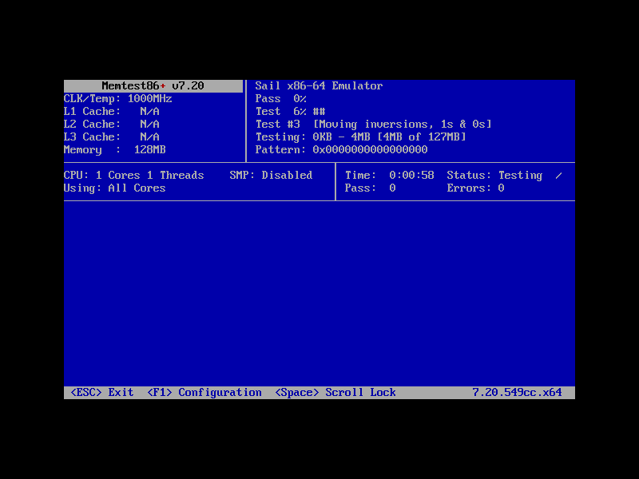
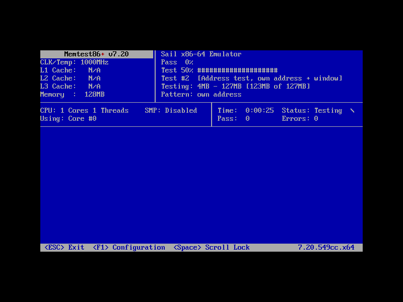

# Memtest86+ v7.20 boot results

**Boot confirmed through SeaBIOS and the ATAPI CD-ROM.** Memtest86+ detects
`Sail x86-64 Emulator`, one core / one thread, and 128 MiB of memory. The
800x600 VBE screen and COM1 both show the first pass starting with zero
reported errors. The final attempt stops at test #3, **Moving inversions,
1s & 0s**, with serial progress from **3% to 6%**. The completed-pass count
remains **0**; no full memory-test pass was run.

Date: 2026-09-25. Worktree: `sail-x86-os5`, branch `os-boot-memtest`, starting
commit `18e90a9`. All three attempts use the supplied
`build/llvm/sail-x86-system`, built with **sail-llvm**. No official Sail
compiler, CMake build, or CTest target was invoked. No emulator/model source
change or rebuild was needed for the successful BIOS boot. The reference
`/home/ruiu/sail-x86-os/docs/os-boot-results.md` was read only.



## Media and configuration

The free, GPL Memtest86+ project at [memtest.org](https://www.memtest.org/)
now advertises v8.10. This task deliberately uses **v7.20**, the newest v7
release listed in its [official archive](https://www.memtest.org/archives).
The [v7.20 README](https://github.com/memtest86plus/memtest86plus/blob/v7.20/README.md)
documents `console=ttyS0,115200` and Linux boot-protocol loading.

Downloaded with curl into `build/os-boot/`:

```sh
mkdir -p build/os-boot
curl -fL --retry 3 https://www.memtest.org/download/v7.20/mt86plus_7.20.binaries.zip \
  -o build/os-boot/mt86plus_7.20.binaries.zip
curl -fL --retry 3 https://www.memtest.org/download/v7.20/mt86plus_7.20_64.grub.iso.zip \
  -o build/os-boot/mt86plus_7.20_64.grub.iso.zip
curl -fsSL --retry 3 https://www.memtest.org/download/v7.20/mt86plus_7.20.src.zip \
  -o build/os-boot/mt86plus_7.20.src.zip
curl -fsSL --retry 3 https://www.memtest.org/download/v7.20/sha256sum.txt \
  -o build/os-boot/memtest-v7.20-sha256sum.txt
unzip -o build/os-boot/mt86plus_7.20.binaries.zip -d build/os-boot/memtest-v7.20
unzip -o build/os-boot/mt86plus_7.20_64.grub.iso.zip -d build/os-boot/memtest-v7.20
unzip -q build/os-boot/mt86plus_7.20.src.zip -d build/os-boot/memtest-v7.20-src
```

All three ZIP hashes match the published `sha256sum.txt`:

| File | SHA-256 |
|---|---|
| `mt86plus_7.20.binaries.zip` | `8aa81b2ac218f4848af4c1a6cff1c1a8a6cdfa884f37c426b8185894b65f09c3` |
| `mt86plus_7.20_64.grub.iso.zip` | `e8b79a6686297f8812d9cf651b0e28b47ed5f3cec2ad10de429ed015a0529e73` |
| `mt86plus_7.20.src.zip` | `92efc66c4df757b00b1ce95216cbb9d792b80c0b5d05077fe536450fdbd0f80c` |

The binaries ZIP's `memtest64.bin` identifies itself as `7.20.52c6c.x64`;
the official GRUB ISO's `/boot/memtest` identifies itself as `7.20.549cc.x64`.
Both are upstream downloads, not locally compiled guests. The latter is
byte-for-byte unchanged in the configured ISO (`cmp` verified).

The [saved GRUB configuration](os-boot/memtest-7.20-grub.cfg) changes only
three things from the official ISO's configuration: select menu entry 1
(legacy keyboard), set the timeout to zero, and append
`console=ttyS0,115200` to that entry. It retains the supplied VBE graphics
configuration. No SMP, memory-identification, or benchmark disabling option
is added to the selected entry.

```sh
xorriso -indev build/os-boot/memtest-v7.20/grub-memtest.iso \
  -outdev build/os-boot/memtest-7.20-serial.iso \
  -boot_image any replay \
  -map docs/os-boot/memtest-7.20-grub.cfg /boot/grub/grub.cfg
```

The actual preparation used `build/os-boot/memtest-serial-grub.cfg`, whose
contents are identical to the saved file above. Extraction from the resulting
ISO and `cmp` also verified the configuration. Use a fresh output path when
recreating the ISO.

| Input/artifact | SHA-256 |
|---|---|
| Original `grub-memtest.iso` | `26caee81b26e91a3a62f3c7bbcb6938ae3ed607ada97bf8789adf3b833a65c20` |
| Configured `memtest-7.20-serial.iso` | `613cb0b8c5cb30d0d49ccd749566c7c6eb8ad59c830cf20198bc0291025c9622` |
| ISO `/boot/memtest` payload | `cf5b4050beca6316e9a886e5e54c463e96b741caf7b18f50ec1f5f6d9bb8ebc7` |
| ZIP `memtest64.bin` payload | `9ea682cce47eebd9bb0a7c41a40adbeedcee462a53a5f1fa56f145c19a3e5bc8` |
| `build/bios.bin` | `888830e2b45d64866b461ebfc27aaaa6fa60e993f557a8dd1cc5abad2bd36d44` |
| `build/vgabios.bin` | `62c8300e0fa564fd26b596fa4327b081fc159e828a0330ec45b61cd428919d55` |
| `build/llvm/sail-x86-system` | `5122589a9197a138464388fef8f132207a6b59d42f3e9e0ee16e1a0c42fe05fa` |

## Attempts

All attempts configure 128 MiB and `-ips 4`. Instruction counts and wall
times below are the runner's final measurements, including capture/stop
overhead. All emulator exit statuses are zero. Combined boot-attempt wall
time is **195.428 seconds**. Screenshots come directly from the emulator's
SIGUSR1/SIGUSR2 framebuffer capture, without reconstruction or image edits.

| Attempt | Wall seconds | Instructions | Result and stop |
|---|---:|---:|---|
| `memtest-direct-01` | 33.815 | 169,091,509 | Serial reaches test #3 at 63%; incomplete direct-loader BIOS services give 59 MiB and a blank PNG; manual SIGTERM |
| `memtest-bios-02` | 78.820 | 420,716,620 | Correct 128 MiB, test #2 at 50% on VBE, test #0 at 25% then 50% on COM1; manual SIGTERM |
| `memtest-bios-03` | 82.793 | 433,662,843 | Correct 128 MiB, test #3 at 6% on both VBE and COM1; automatic expected-output stop |

### memtest-direct-01

```sh
python3 system-emu/run-boot.py --name memtest-direct-01 --timeout 180 -- \
  build/llvm/sail-x86-system -ips 4 -m 128 \
  -a 'console=ttyS0,115200' build/os-boot/memtest-v7.20/memtest64.bin
```

The image has the `HdrS` Linux boot header and runs in long mode. Serial
detects the CPU and starts testing, but the reported 59 MiB is incorrect for
the configured RAM. `load_bzimage()` supplies minimal IRET BIOS stubs instead
of SeaBIOS: INT 15h does not supply the real E820 map, while memtest's setup
code tries E820, E801, then AH=88h. The loader also does not initialize the
VGA font/palette in this serial boot mode, so the PNG is blank even though
the VGA text-memory dump contains memtest's interface. This attempt is not
the successful platform result; the authorized SeaBIOS boot route supplies
the missing firmware services.

Captured with `kill -USR1 "$(cat build/os-boot/memtest-direct-01.pid)"` at
102,562,183 instructions, then stopped with
`kill -TERM "$(cat build/os-boot/memtest-direct-01.pid)"` after serial progress.
The PNG and text-memory capture precede the final instruction count.

Last serial update, with ANSI positioning removed (the partial `ing:` /
`ern:` labels are retained exactly from the emitted update):

```text
  0%
 63% #########################
 #3  [Moving inversions, 1s & 0s]
ing: 0KB - 4MB [4MB of 58.6MB]
ern: 0xffffffffffffffff
CPU: 1 Cores 1 Threads    SMP: Disabled   | Time:  0:00:32  Status: Testing  |
Using: All Cores                          | Pass:  0        Errors: 0
```

[PNG](os-boot/memtest-direct-01.png) ·
[Raw serial](os-boot/memtest-direct-01.serial) ·
[Serial text](os-boot/memtest-direct-01.serial.txt) ·
[CPU/device/VGA log](os-boot/memtest-direct-01.stderr) ·
[Runner JSON](os-boot/memtest-direct-01.json)

### memtest-bios-02

```sh
SAIL_X86_BIOS_DEBUG=1 python3 system-emu/run-boot.py \
  --name memtest-bios-02 --timeout 180 -- \
  build/llvm/sail-x86-system -ips 4 -m 128 -b build/bios.bin \
  -cdrom build/os-boot/memtest-7.20-serial.iso -boot d
```

SeaBIOS 1.16.3 boots GRUB from the ATAPI CD-ROM. Firmware reports usable
RAM at `00000000–0009fbff` and `00100000–07ffdfff`, with the low-memory
holes and top 8 KiB reserved. Memtest reports **128MB**, approximately
**127MB** in its testing-range display, a **1000MHz** emulated CPU,
**1 core / 1 thread**, and unavailable cache sizes. SMP remains at memtest's
default disabled setting for this single-core run.

The screen reaches **test #2, Address test, own address + window, 50%**,
testing the range **4MB–127MB**, with **Pass: 0, Errors: 0**. COM1 records
test #0 advancing from 25% to 50%. Serial redraws are periodic, so they do
not include every intermediate test shown on the framebuffer.

The test #2 PNG was captured at 338,678,861 instructions and again at
419,895,913 instructions. Those PNGs were byte-for-byte identical
(`e5180486304441bf34e05d919799bbb499e7bf9e9e24cfe13ee0ef4cda6f8839`).
A blank image preview during inspection prompted attempt 03; checking the
saved files established that the text had not disappeared from the PNG.

Stopped after capturing state with SIGUSR1, waiting 0.25 seconds, and
sending SIGTERM to the PID in `build/os-boot/memtest-bios-02.pid`.

Last serial update, with ANSI positioning removed:

```text
  0%
 50% ####################
 #0  [Address test, walking ones, no cache]
ing: 0KB - 4MB [4MB of 127MB]
ern: 0xffffffffffffffff
CPU: 1 Cores 1 Threads    SMP: Disabled   | Time:  0:00:00  Status: Testing  /
Using: Core #0                            | Pass:  0        Errors: 0
```



[Raw serial](os-boot/memtest-bios-02.serial) ·
[Serial text](os-boot/memtest-bios-02.serial.txt) ·
[Firmware/CPU/device log](os-boot/memtest-bios-02.stderr) ·
[Runner JSON](os-boot/memtest-bios-02.json)

### memtest-bios-03

This is the recommended short reproduction: stop as soon as test #3
appears on COM1, with a 150-second fallback deadline. The runner captures
state and PNG before terminating the emulator.

```sh
SAIL_X86_BIOS_DEBUG=1 python3 system-emu/run-boot.py \
  --name memtest-bios-03 --timeout 150 --expect ' #3  ' -- \
  build/llvm/sail-x86-system -ips 4 -m 128 -b build/bios.bin \
  -cdrom build/os-boot/memtest-7.20-serial.iso -boot d
```

Same detection and memory map as attempt 02. The serial console records
test #0 at **25%, 50%**, then test #3 at **3%, 6%**. The final VBE screenshot
also shows **test #3 at 6%**, with guest elapsed time **0:00:58**, no errors,
and no completed passes. The final capture is at **432,753,554** instructions;
the emulator exits shortly afterward at **433,662,843**. Runner reason:
`expected output`. A diagnostic SIGUSR1 was also sent earlier, at
approximately 65.7 wall seconds, while test #2 was active.

Initial serial detection (selected lines, ANSI positioning removed):

```text
      Memtest86+ v7.20
| Sail x86-64 Emulator
CLK/Temp: 1000MHz           | Pass   %
L1 Cache:   N/A             | Test   %
L2 Cache:   N/A             | Test #
L3 Cache:   N/A             | Testing:
Memory  :  128MB            | Pattern:
CPU: 1 Cores 1 Threads    SMP: Disabled   | Time:           Status: Testing  -
```

Final two serial progress updates, with ANSI positioning removed:

```text
  0%
  3% #
 #3  [Moving inversions, 1s & 0s]
ing: 0KB - 4MB [4MB of 127MB]
ern: 0x0000000000000000
CPU: 1 Cores 1 Threads    SMP: Disabled   | Time:  0:00:58  Status: Testing  /
Using: All Cores                          | Pass:  0        Errors: 0
  0%
  6% ##
 #3  [Moving inversions, 1s & 0s]
ing: 0KB - 4MB [4MB of 127MB]
ern: 0x0000000000000000
CPU: 1 Cores 1 Threads    SMP: Disabled   | Time:  0:00:58  Status: Testing  /
Using: All Cores                          | Pass:  0        Errors: 0
```

[Final PNG](os-boot/memtest-bios-03.png) ·
[Raw serial](os-boot/memtest-bios-03.serial) ·
[Serial text](os-boot/memtest-bios-03.serial.txt) ·
[Firmware/CPU/device log](os-boot/memtest-bios-03.stderr) ·
[Runner JSON](os-boot/memtest-bios-03.json)

## Validation and scope

Download SHA-256 verification passed for all three upstream ZIPs. The
configured ISO retains the original memtest payload and the expected GRUB
configuration. All three retained PNGs decode successfully, and the final
BIOS screenshot was visually checked against the serial progress. There
were no guest exceptions, memory-test errors, or firmware/device failures
observed in the successful short BIOS attempts.

This establishes boot, CPU/memory detection, COM1 output, VBE output, and
initial memory-test progress. It is not a full-pass memory validation or a
benchmark of the host: the clock and cache information are the emulator's
reported platform properties. No source fix was made, so no new instruction
regression or emulator test build was required. The original direct-loader
firmware limitations remain outside the successful SeaBIOS route.
