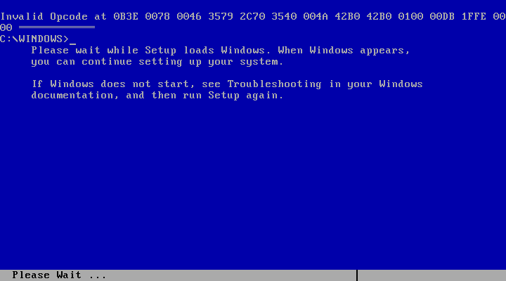
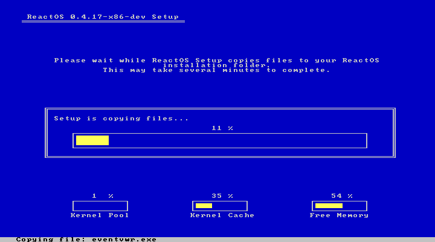
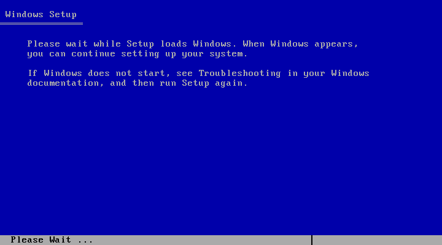
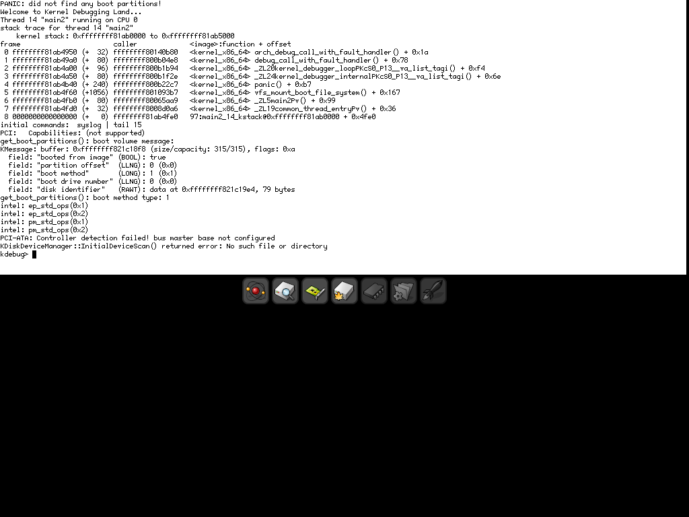
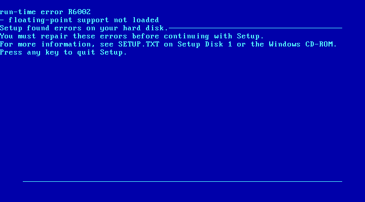
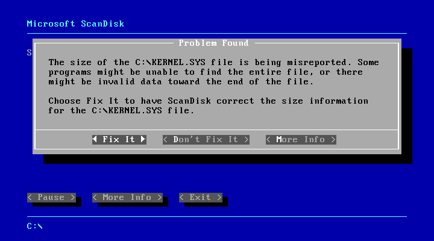
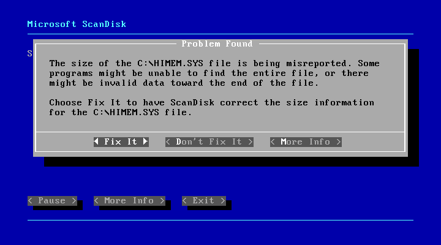
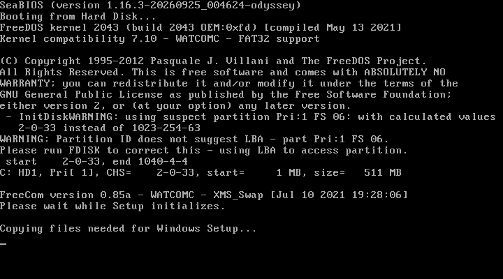

# Operating-system boot results

Worktree: `sail-x86-os`. All disk images used for writes are copies under
`build/os-boot`; original media under `/home/ruiu/os-images` are read only.
The machine has one CPU, xAPIC, a 24-input I/O APIC, SeaBIOS MP/ACPI tables,
a PIIX4 PM timer, two primary IDE disks, an ATAPI CD-ROM, Bochs VBE and
planar VGA. It has no HPET or additional CPUs.

## Final status

| OS | Farthest observed progress | Remaining blocker |
|---|---|---|
| xv6 | Serial `$` shell; filesystem on IDE slave | None for the requested boot |
| Linux i386 | Serial `sail#` shell | None for the requested boot |
| Linux amd64 | `sail#` through BIOS/ISO with ACPI and I/O APIC, and by direct bzImage boot | Neither command line needs `noapic nolapic` |
| Haiku | COM1 output and graphical kernel debugger at 1024x768 | Boot-volume panic: PCI-ATA requires the missing bus-master IDE BAR/registers; no desktop |
| ReactOS | Fresh text installation completed and rebooted into graphical second-stage setup at 800×600: “Installing devices” | Second stage active after one hour; offline FAT defects recorded, with the same class of damage reproduced in a timed QEMU control |
| FreeBSD | CD Loader 1.2 and BTX entry | Fails before loader prompt; virtual-8086 boot path remains unsupported |
| Windows 3.1 | Express Setup, first-stage copy, protected-mode DOSX startup | LMSW bug fixed; next #GP is an unsupported 16-bit call gate; no graphical screen |
| Windows 95 | ScanDisk repair UI; `SETUP /IS` copies startup files and enters protected-mode DOSX | R6002 (XLAT) and keyboard bugs fixed; same unsupported 16-bit call gate as Windows 3.1 blocks graphics; subsequent ScanDisk size reports remain unclassified |

The APIC/IOAPIC, IDE slave, MP/ACPI firmware, VBE/PNG and planar VGA work
is committed separately, along with the boot fixes. The boot-related Sail
corrections cover the CR8/APIC alias, real-mode IRET NT handling, LMSW's
protected-mode transition, XLAT's segment selection, and STI's interrupt inhibition. Each has an
SDM citation and an instruction regression in the same commit. The C++ x87
memory-capacity fix passes aligned and noncontiguous-page save/restore tests.
All **15 official-build system tests** pass; the basic suite contains
**65 cases**, also passing with sail-llvm. BIOS graphics fixtures separately
validate modes 12h, 13h and VBE 101h. Those test patterns are not Windows screenshots.

Original-session measured boot-attempt wall time: xv6 6.21 min, Linux 51.91 min,
Haiku 57.79 min, ReactOS 52.83 min, FreeBSD 4.69 min, Windows 3.1 58.38 min,
and Windows 95 58.38 min. These totals predate the continuation sections.
Attempts ran concurrently. Each attempt below
records its exact command and last serial output, including silent consoles.

## Reproduction and measurement

Build the emulator and firmware from the repository root. All attempts in
the sail-llvm continuation use `build/llvm/sail-x86-system`; rerun the LLVM
build script after any model or emulator-source change:

```sh
cmake -B build
cmake --build build -j64
system-emu/mk-freedos.sh build
system-emu/build-llvm.sh
```

SeaBIOS 1.16.3 uses `CONFIG_MPTABLE=y`, `CONFIG_ACPI=y`,
`CONFIG_ACPI_DSDT=y`; SeaVGABIOS uses `CONFIG_VGA_BOCHS=y`,
`CONFIG_VGA_BOCHS_STDVGA=y`, `CONFIG_VGA_VBE=y`, `CONFIG_VGA_PCI=y`.
PCI functions are ISA at 00:01.0, IDE at 00:01.1 and PM at 00:01.3.
The supplied SDM revision 090 numbers its APIC chapter **13** (chapter 12
in older editions). The CR8/APIC alias follows SDM Vol.3A sections 13.8.6–13.8.6.1 and has a guest-instruction regression.

`system-emu/run-boot.py` records the exact emulator/runner commands,
monotonic wall time, exit status, serial output and final instruction count
in `build/os-boot/NAME.{json,serial,stderr}`. The count is the emulator's
step count, including interrupt entries; HLT clock advancement does not add
instructions. Wall time includes diagnostic capture at termination.
`SIGUSR1` dumps CPU/APIC/PIC and VGA text, and optionally guest RAM.
`SIGUSR2` writes `framebuffer.png`; `SAIL_X86_FRAMEBUFFER` selects a path.
The runner saves graphical captures as `build/os-boot/NAME.png`.

`-kbd` routes stdin to the emulated keyboard. `Ctrl-a s` switches input to
COM1 and `Ctrl-a k` switches it back. This permits a BIOS loader to switch
to a serial console without restarting the emulator.

## Device validation

```sh
cmake --build build -j128 --target system_test_basic system_test_paging \
  system_test_exceptions system_test_a20 system_test_vmx system_test_ide \
  system_test_apic system_test_fw_cfg system_test_vbe system_test_vga \
  system_test_apic_cpu system_test_keyboard system_test_rtc
ctest --test-dir build -R '^system_' --output-on-failure
```

All 14 system/device/PNG tests pass. Coverage includes APIC priorities, self-IPIs,
timer modes/divisors, edge/level routing and EOI; independent IDE master/slave
transfers; fw_cfg topology; PM timer/ACPI mode; PCI BAR remapping; framebuffer
formats/banking/offsets; PNG CRC and decompression; VGA latches/write modes,
chain-4 and palettes; SMRAM and option-ROM shadow separation; keyboard
output-port/A20 commands; RTC periodic, update and alarm interrupts; and
CPU interrupt dispatch and CR8/APIC aliasing; real-mode IRET with NT set;
and 108-byte x87 saves/restores across noncontiguous pages.

## Prepared images

The xv6 boot and filesystem images are copied to `build/os-boot/xv6.img`
and `build/os-boot/xv6-fs.img` before attaching them as writable disks.

The Linux APIC test kernel is built from Linux 6.19.6 using
`system-emu/mk-linux.sh`'s tiny configuration plus `CONFIG_SMP=y`,
`CONFIG_ACPI=y`, `CONFIG_PCI=y`, `CONFIG_X86_LOCAL_APIC=y` and
`CONFIG_X86_IO_APIC=y`, with 128 build jobs. It retains that script's existing
deterministic boot RNG patch. The test packages the 32-bit initramfs supplied in
`/home/ruiu/os-images/linux-i386`; the kernel enables IA32 emulation.
A small test ISO uses ISOLINUX/ldlinux.c32 extracted from the supplied Alpine
ISO and the new kernel, so Linux can discover the firmware APIC tables.
Its kernel command line is:

```text
console=ttyS0,115200 earlyprintk=serial,ttyS0,115200 tsc=reliable nokaslr norandmaps loglevel=7 rdinit=/init
```

Windows 3.1 setup files were extracted from `win31.iso` with xorriso and
copied with mtools into `C:\WIN31` on `build/os-boot/win31.img`, a copy of
`build/freedos.img` (FAT16 partition offset 1048576). AUTOEXEC.BAT changes
to that directory and runs SETUP. Windows 95 has a separate 512 MB disk
with one FAT16 partition, starting at sector 2048; its supplied CD boots an
MS-DOS floppy image which loads HIMEM/CD-ROM support and starts OEMSETUP.

## Boot attempts

SeaBIOS uses `CONFIG_USE_SMM=n` and `CONFIG_CALL32_SMM=n`: its QEMU SMM
trampoline expects a different save-state layout. The emulator implements
FADT ACPI enable/disable commands in its PM device. This preserves the
firmware's MP/ACPI tables without changing the Intel SMM model to match QEMU.


### xv6-01

Stopped during SeaBIOS SMM relocation before disk boot. Last firmware debug output: `WARNING - internal error detected at handle_smi:87!`. Stopped manually after collecting CPU state.

```sh
SAIL_X86_BIOS_DEBUG=1 system-emu/run-boot.py --name xv6-01 --timeout 300 --expect '\$ ' -- build/system-emu/sail-x86-system -ips 4 -b build/bios.bin -hda build/os-boot/xv6.img -hdb build/os-boot/xv6-fs.img
```

Wall time: **109.418 s**. Instructions: **37,869,036**.

Last serial output:

```text
(no serial output)
```

### xv6-02

**Reached the serial `$` shell.** The kernel enabled its local APIC periodic timer and I/O APIC, and mounted the filesystem from the primary IDE slave.

```sh
SAIL_X86_BIOS_DEBUG=1 system-emu/run-boot.py --name xv6-02 --timeout 300 --expect '\$ ' -- build/system-emu/sail-x86-system -ips 4 -b build/bios.bin -hda build/os-boot/xv6.img -hdb build/os-boot/xv6-fs.img
```

Wall time: **263.322 s**. Instructions: **20,156,878**.

Last serial output:

```text
xv6...
cpu0: starting 0
sb: size 1000 nblocks 941 ninodes 200 nlog 30 logstart 2 inodestart 32 bmap start 58
init: starting sh
$
```

### linux-apic-01

Reached the 64-bit kernel, MADT discovery, symmetric I/O APIC routing (timer pin 2), ACPI interpreter, PCI enumeration and initramfs unpacking. The 900-second bound expired before a shell. This used the pre-RTC-fix emulator.

```sh
SAIL_X86_BIOS_DEBUG=1 system-emu/run-boot.py --name linux-apic-01 --timeout 900 --expect 'sail# ' -- build/system-emu/sail-x86-system -ips 4 -b build/bios.bin -cdrom build/os-boot/linux-apic.iso -boot d
```

Wall time: **900.844 s**. Instructions: **153,048,662**.

Last serial output:

```text
pci 0000:00:02.0: vgaarb: VGA device added: decodes=io+mem,owns=io+mem,locks=none
vgaarb: loaded
clocksource: Switched to clocksource tsc-early
ACPI: Failed to create genetlink family for ACPI event
pnp: PnP ACPI init
pnp: PnP ACPI: found 4 devices
clocksource: acpi_pm: mask: 0xffffff max_cycles: 0xffffff, max_idle_ns: 2085701024 ns
pci_bus 0000:00: resource 4 [io  0x0000-0x0cf7 window]
pci_bus 0000:00: resource 5 [io  0x0d00-0xffff window]
pci_bus 0000:00: resource 6 [mem 0x000a0000-0x000bffff window]
pci_bus 0000:00: resource 7 [mem 0x80000000-0xfebfffff window]
pci 0000:00:01.0: PIIX3: Enabling Passive Release
pci 0000:00:00.0: Limiting direct PCI/PCI transfers
PCI: CLS 0 bytes, default 64
Unpacking initramfs...
RAPL PMU: API unit is 2^-32 Joules, 0 fixed counters, 10737418240 ms ovfl timer
```

### linux-i386-01

**Reached the serial `sail#` shell.** This is the supplied 32-bit kernel and initramfs, with an explicit command line omitting APIC-disabling flags. The supplied kernel itself is uniprocessor without APIC support; the separate 64-bit test exercises APICs.

```sh
system-emu/run-boot.py --name linux-i386-01 --timeout 900 --expect 'sail# ' -- build/system-emu/sail-x86-system -ips 4 -a 'console=ttyS0 earlyprintk=serial,ttyS0 tsc=reliable nokaslr norandmaps rdinit=/init' -i /home/ruiu/os-images/linux-i386/initramfs-i386.cpio /home/ruiu/os-images/linux-i386/bzImage-i386
```

Wall time: **328.832 s**. Instructions: **55,971,204**.

Last serial output:

```text
microcode: Current revision: 0x00000000
input: AT Translated Set 2 keyboard as /devices/platform/i8042/serio0/input/input0
sched_clock: Marking stable (10453434250, 29533000)->(10485958500, -2991250)
Freeing unused kernel image (initmem) memory: 196K
Write protecting kernel text and read-only data: 1632k
Run /init as init process

========================================
 Sail x86-64 Emulator - Linux Console
========================================

Type 'help' for a list of built-in commands.
Press Ctrl-a x to exit the emulator.


sail#
```

### freebsd-01

Reached CD Loader 1.2 and **Starting the BTX loader**, then ceased making boot progress. No loader prompt or serial console appeared, so the scheduled `set console=comconsole` and `boot -s` did not take effect. The final CPU ran through zero-filled memory in protected mode. Stopped manually for diagnosis.

```sh
SAIL_X86_BIOS_DEBUG=1 system-emu/run-boot.py --name freebsd-01 --timeout 900 --send 45:3 --send '75:set console=comconsole\n' --send '90:\x01sboot -s\n' -- build/system-emu/sail-x86-system -ips 4 -kbd -b build/bios.bin -cdrom /home/ruiu/os-images/FreeBSD-14.5-RELEASE-amd64-disc1.iso -boot d
```

Wall time: **163.759 s**. Instructions: **22,728,435**.

Last serial output:

```text
(no serial output)
```

### freebsd-trace-02

Diagnostic trace: bounded at 5,000,000 instructions, still in SeaBIOS. No serial output.

```sh
SAIL_X86_BIOS_DEBUG=1 SAIL_X86_TRACE_START=0 SAIL_X86_TRACE_END=5000000 SAIL_X86_TRACE_STEP=100000 system-emu/run-boot.py --name freebsd-trace-02 --timeout 180 -- build/system-emu/sail-x86-system -ips 4 -b build/bios.bin -cdrom /home/ruiu/os-images/FreeBSD-14.5-RELEASE-amd64-disc1.iso -boot d
```

Wall time: **13.608 s**. Instructions: **5,000,000**.

Last serial output:

```text
(no serial output)
```

### freebsd-trace-03

Diagnostic trace: BTX starts around 6,100,000 instructions, then execution escapes to zero-filled memory. No serial output.

```sh
SAIL_X86_BIOS_DEBUG=1 SAIL_X86_TRACE_START=5000000 SAIL_X86_TRACE_END=8000000 SAIL_X86_TRACE_STEP=10000 system-emu/run-boot.py --name freebsd-trace-03 --timeout 180 -- build/system-emu/sail-x86-system -ips 4 -b build/bios.bin -cdrom /home/ruiu/os-images/FreeBSD-14.5-RELEASE-amd64-disc1.iso -boot d
```

Wall time: **39.032 s**. Instructions: **8,000,000**.

Last serial output:

```text
(no serial output)
```

### freebsd-trace-04

Diagnostic trace: BTX exception formatting returns at instruction 6,114,173 from CS:EIP `0008:000094cf` with SS=`ffff`, ESP=`fffe757b`; RET transfers to `0080bd32`, then executes zero bytes. The model has no virtual-8086 return path in its IRETD implementation, which BTX requires. No model workaround was added.

```sh
SAIL_X86_BIOS_DEBUG=1 SAIL_X86_TRACE_START=6110000 SAIL_X86_TRACE_END=6120000 SAIL_X86_TRACE_STEP=1 system-emu/run-boot.py --name freebsd-trace-04 --timeout 180 -- build/system-emu/sail-x86-system -ips 4 -b build/bios.bin -cdrom /home/ruiu/os-images/FreeBSD-14.5-RELEASE-amd64-disc1.iso -boot d
```

Wall time: **27.026 s**. Instructions: **6,120,000**.

Last serial output:

```text
(no serial output)
```

### haiku-01

Reached **64-bit kernel code** and selected **VBE 1024x768x32** (mode 144h). The captured image was black: duplicate VGA ROM initialization advertised E0000000 while BAR0 was FD000000. This is fixed by commit `6f5546d`. COM1 remained silent. The supervisor was paused at 818.4 seconds while the guest continued decompressing, then resumed to collect this result; effective duration was 1135 seconds, within the OS budget.

```sh
SAIL_X86_BIOS_DEBUG=1 system-emu/run-boot.py --name haiku-01 --timeout 900 -- build/system-emu/sail-x86-system -ips 4 -b build/bios.bin -cdrom /home/ruiu/os-images/haiku-r1beta5-x86_64-anyboot.iso -boot d
```

Wall time: **1134.972 s**. Instructions: **175,736,527**.

Last serial output:

```text
(no serial output)
```

### reactos-01

The supplied ISO defaults to **Live (Debug)**, despite its bootcd filename. Reached ReactOS kernel CPU-feature reporting and a VGA request to connect a debugger on COM1. Only RTC IRQ 8 was unmasked in the final state; the static CMOS device supplied no periodic interrupts. Stopped manually.

```sh
SAIL_X86_BIOS_DEBUG=1 system-emu/run-boot.py --name reactos-01 --timeout 900 --send '30:\n' -- build/system-emu/sail-x86-system -ips 4 -kbd -b build/bios.bin -cdrom /home/ruiu/os-images/reactos-bootcd-0.4.17-dev-915-g3f5fd48-x86-gcc-lin-dbg.iso -boot d
```

Wall time: **308.531 s**. Instructions: **67,301,977**.

Last serial output:

```text
(/srv/buildbot/worker_data/Build_GCCLin_x86/build/boot/freeldr/freeldr/arch/i386/hwpci.c:111) err: No valid routing table found!
(ntoskrnl/kd64/kdinit.c:94) -----------------------------------------------------
(ntoskrnl/kd64/kdinit.c:95) ReactOS 0.4.17-x86-dev (Build 20260924-0.4.17-dev-915-g3f5fd48) (Commit 3f5fd48b637f96ce589886dc1548b8e9ffb42448)
(ntoskrnl/kd64/kdinit.c:96) 1 System Processor [256 MB Memory]
(ntoskrnl/kd64/kdinit.c:100) Command Line: DEBUG DEBUGPORT=COM1 BAUDRATE=115200 SOS FASTDETECT MININT
(ntoskrnl/kd64/kdinit.c:103) ARC Paths: multi(0)disk(0)cdrom(96) \ multi(0)disk(0)cdrom(96) \reactos\
(ntoskrnl/ke/i386/cpu.c:356) Supported CPU features: KF_RDTSC KF_CR4 KF_CMOV KF_GLOBAL_PAGE KF_LARGE_PAGE KF_MTRR KF_CMPXCHG8B KF_MMX KF_WORKING_PTE KF_PAT KF_FXSR KF_FAST_SYSCALL KF_XMMI KF_XMMI64 KF_NX_BIT X86_FEATURE_PAE X86_FEATURE_APIC
(ntoskrnl/ke/i386/cpu.c:652) Prefetch Cache: 64 bytes	L2 Cache: 0 bytes	L2 Cache Line: 64 bytes	L2 Cache Associativity: 0
```

### reactos-setup-02

Local ISO selects **ReactOS Setup (Text Mode)** with `/NODEBUG /NOGUIBOOT /SIFOPTIONSOVERRIDE`. Loaded the setup system hive and entered kernel code; timed out with only RTC IRQ 8 unmasked. The subsequent RTC device fix targets this calibration wait. No setup selection screen yet.

```sh
SAIL_X86_BIOS_DEBUG=1 system-emu/run-boot.py --name reactos-setup-02 --timeout 900 --send '30:\n' -- build/system-emu/sail-x86-system -ips 4 -kbd -b build/bios.bin -cdrom build/os-boot/reactos-setup.iso -boot d
```

Wall time: **900.483 s**. Instructions: **219,066,326**.

Last serial output:

```text
(/srv/buildbot/worker_data/Build_GCCLin_x86/build/boot/freeldr/freeldr/arch/i386/hwpci.c:111) err: No valid routing table found!
```

### win31-01

FreeDOS booted from the hard disk and Windows Setup displayed **Installing XMS memory manager...**. No graphical screen. Stopped manually after diagnosis.

```sh
SAIL_X86_BIOS_DEBUG=1 system-emu/run-boot.py --name win31-01 --timeout 900 --send '90:\n' --send '150:\n' --send '210:\n' -- build/system-emu/sail-x86-system -ips 4 -kbd -b build/bios.bin -hda build/os-boot/win31.img -cdrom /home/ruiu/os-images/win31.iso -boot c
```

Wall time: **656.856 s**. Instructions: **121,442,750**.

Last serial output:

```text
(no serial output)
```

### win31-02

Retried with 32 MB and 8042 output-port/A20 support. Reached the same **Installing XMS memory manager...** text screen; stopped manually.

```sh
SAIL_X86_BIOS_DEBUG=1 system-emu/run-boot.py --name win31-02 --timeout 900 --send '60:\n' --send '120:\n' --send '180:\n' -- build/system-emu/sail-x86-system -ips 4 -m 32 -kbd -b build/bios.bin -hda build/os-boot/win31.img -cdrom /home/ruiu/os-images/win31.iso -boot c
```

Wall time: **557.434 s**. Instructions: **104,596,510**.

Last serial output:

```text
(no serial output)
```

### win31-himem-03

Preloaded the supplied Windows 95 floppy HIMEM.SYS through FreeDOS FDCONFIG.SYS, using 16 MB. Stalled during DOS driver initialization before Setup. This run predates the RTC interrupt fix; stopped manually.

```sh
SAIL_X86_BIOS_DEBUG=1 system-emu/run-boot.py --name win31-himem-03 --timeout 900 --send '60:\n' --send '120:\n' --send '180:\n' -- build/system-emu/sail-x86-system -ips 4 -m 16 -kbd -b build/bios.bin -hda build/os-boot/win31-himem.img -boot c
```

Wall time: **396.488 s**. Instructions: **73,434,957**.

Last serial output:

```text
(no serial output)
```

### win95-01

The original CD booted its MS-DOS startup image and printed **Starting Windows 95...**, then requested the command interpreter at `A>`. No graphical screen. Also supplied `a:\command.com` through the keyboard at runtime; it did not advance. Stopped manually.

```sh
SAIL_X86_BIOS_DEBUG=1 system-emu/run-boot.py --name win95-01 --timeout 900 --send '60:\n' --send '120:\n' --send '180:\n' -- build/system-emu/sail-x86-system -ips 4 -kbd -b build/bios.bin -hda build/os-boot/win95.img -cdrom /home/ruiu/os-images/win95.iso -boot d
```

Wall time: **657.643 s**. Instructions: **115,028,097**.

Last serial output:

```text
(no serial output)
```

### win95-floppy-02

Retried the CD boot image as a physical floppy with the original CD attached and 64 MB RAM. Again reached **Type the name of the Command Interpreter ... A>**; stopped manually.

```sh
SAIL_X86_BIOS_DEBUG=1 system-emu/run-boot.py --name win95-floppy-02 --timeout 900 --send '60:\n' --send '120:\n' --send '180:\n' -- build/system-emu/sail-x86-system -ips 4 -m 64 -kbd -b build/bios.bin -fda build/os-boot/win95-boot.img -hda build/os-boot/win95.img -cdrom /home/ruiu/os-images/win95.iso -boot a
```

Wall time: **558.044 s**. Instructions: **100,950,710**.

Last serial output:

```text
(no serial output)
```

## BIOS graphics integration

```sh
python3 system-emu/tests/boot-graphics.py
```

All three BIOS-driven fixtures pass pixel/row checks after the duplicate-ROM
fix: mode 12h at 640x480 (eight test colors), mode 13h at 320x200 (two
colors), and VBE 101h at 640x480 (four colors). PNGs are
`build/os-boot/bios-mode12.png`, `bios-mode13.png`, and `bios-mode101.png`.
These are diagnostic test patterns, not OS screenshots. The fixtures print
`GRAPHICS READY` and deliberately halt with IF clear to trigger capture.
Their simulator exit status 1 is expected; validation checks the marker
and the actual PNG pixels.

### linux-apic-02

**Reached the serial `sail#` shell with local APIC, I/O APIC and ACPI enabled.**
Linux enumerates IOAPIC GSI 0–23, routes the timer through pin 2, reports
`APIC: Switch to symmetric I/O mode setup`, and uses ACPI IRQ routing.
The command line contains neither `noapic` nor `nolapic`.

```sh
SAIL_X86_BIOS_DEBUG=1 system-emu/run-boot.py --name linux-apic-02 --timeout 1800 --expect 'sail# ' -- build/system-emu/sail-x86-system -ips 20 -m 64 -b build/bios.bin -cdrom build/os-boot/linux-apic.iso -boot d
```

Wall time: **1135.057 s**. Instructions: **175,907,340**.

Last serial output:

```text
microcode: Current revision: 0x00000000
IPI shorthand broadcast: enabled
sched_clock: Marking stable (16160969400, 10641050)->(6478759450, 9692851000)
Freeing unused kernel image (initmem) memory: 736K
Write protecting the kernel read-only data: 8192k
Freeing unused kernel image (text/rodata gap) memory: 1404K
Freeing unused kernel image (rodata/data gap) memory: 1292K
Run /init as init process

========================================
 Sail x86-64 Emulator - Linux Console
========================================

Type 'help' for a list of built-in commands.
Press Ctrl-a x to exit the emulator.


sail# 
```

### haiku-02

**Reached the graphical Haiku boot logo at 1024x768x32 and 64-bit kernel code.**
The PCI ROM fix makes the framebuffer visible. The boot icons remain gray;
no desktop or COM1 output yet. Stopped to retry with the RTC device.


```sh
SAIL_X86_BIOS_DEBUG=1 system-emu/run-boot.py --name haiku-02 --timeout 1900 -- build/system-emu/sail-x86-system -ips 4 -m 1024 -b build/bios.bin -cdrom /home/ruiu/os-images/haiku-r1beta5-x86_64-anyboot.iso -boot d
```

Wall time: **1007.848 s**. Instructions: **177,550,506**.

Last serial output:

```text
(no serial output)
```

### win31-rtc-04

Retried FreeDOS with the preloaded Microsoft HIMEM driver and the new RTC device. It remained in real-mode BIOS interrupt stubs during driver initialization, before Windows Setup. The later IRET regression exposed a real-mode NT handling error.

```sh
SAIL_X86_BIOS_DEBUG=1 system-emu/run-boot.py --name win31-rtc-04 --timeout 900 --send '60:\n' --send '120:\n' --send '180:\n' -- build/system-emu/sail-x86-system -ips 4 -m 16 -kbd -b build/bios.bin -hda build/os-boot/win31-himem.img -boot c
```

Wall time: **900.466 s**. Instructions: **161,686,646**.

Last serial output:

```text
(no serial output)
```

### win95-rtc-03

Retried the original bootable Windows 95 CD with RTC interrupts. MS-DOS still requested the command interpreter (`Type the name of the Command Interpreter ... A>`), although COMMAND.COM is present on its boot image. No graphical screen.

```sh
SAIL_X86_BIOS_DEBUG=1 system-emu/run-boot.py --name win95-rtc-03 --timeout 600 --send '60:\n' --send '120:\n' -- build/system-emu/sail-x86-system -ips 4 -m 64 -kbd -b build/bios.bin -hda build/os-boot/win95.img -cdrom /home/ruiu/os-images/win95.iso -boot d
```

Wall time: **600.504 s**. Instructions: **104,834,774**.

Last serial output:

```text
(no serial output)
```

### win95-freedos-04

Retried Windows 95 from a FreeDOS hard disk containing HIMEM.SYS and the complete WIN95 directory copied from the CD. AUTOEXEC invokes SETUP. It stalled in BIOS interrupt stubs during HIMEM initialization, before SETUP; no graphical screen.

```sh
SAIL_X86_BIOS_DEBUG=1 system-emu/run-boot.py --name win95-freedos-04 --timeout 900 --send '90:\n' --send '150:\n' --send '210:\n' -- build/system-emu/sail-x86-system -ips 4 -m 64 -kbd -b build/bios.bin -hda build/os-boot/win95-freedos.img -boot c
```

Wall time: **900.401 s**. Instructions: **167,204,216**.

Last serial output:

```text
(no serial output)
```

### linux-direct-apic-03

**Reached the serial `sail#` shell using the new default command line.**
Direct bzImage boot also works after removing `noapic nolapic` from both
default command lines. The BIOS/ISO run above separately verifies ACPI
tables and I/O APIC routing.

```sh
system-emu/run-boot.py --name linux-direct-apic-03 --timeout 900 --expect 'sail# ' -- build/system-emu/sail-x86-system -ips 20 -m 64 -i /home/ruiu/os-images/linux-i386/initramfs-i386.cpio build/bzImage
```

Wall time: **749.601 s**. Instructions: **80,070,604**.

Last serial output:

```text
Freeing initrd memory: 1740K
Serial: 8250/16550 driver, 4 ports, IRQ sharing disabled
serial8250: ttyS0 at I/O 0x3f8 (irq = 4, base_baud = 115200) is a 16550A
i8042: PNP: No PS/2 controller found.
i8042: Probing ports directly.
serio: i8042 KBD port at 0x60,0x64 irq 1
intel_pstate: CPU model not supported
input: AT Translated Set 2 keyboard as /devices/platform/i8042/serio0/input/input0
microcode: Current revision: 0x00000000
IPI shorthand broadcast: enabled
sched_clock: Marking stable (2936289150, 7823600)->(2945838300, -1725550)
Freeing unused kernel image (initmem) memory: 736K
Write protecting the kernel read-only data: 8192k
Freeing unused kernel image (text/rodata gap) memory: 1404K
Freeing unused kernel image (rodata/data gap) memory: 1292K
Run /init as init process

========================================
 Sail x86-64 Emulator - Linux Console
========================================

Type 'help' for a list of built-in commands.
Press Ctrl-a x to exit the emulator.


sail# \x1b[6n
```

### freebsd-final-05

Retested with the final RTC and real-mode IRET fixes. BTX still fails before the loader prompt and executes zero-filled memory with `SS=ffff`, `ESP=fffe757f`. Stopped at the configured trace limit. This remains an unsupported boot path; the model has no complete virtual-8086 IRET/interrupt support.

```sh
SAIL_X86_BIOS_DEBUG=1 SAIL_X86_TRACE_START=6000000 SAIL_X86_TRACE_END=8000000 SAIL_X86_TRACE_STEP=100000 system-emu/run-boot.py --name freebsd-final-05 --timeout 180 -- build/system-emu/sail-x86-system -ips 4 -kbd -b build/bios.bin -cdrom /home/ruiu/os-images/FreeBSD-14.5-RELEASE-amd64-disc1.iso -boot d
```

Wall time: **38.244 s**. Instructions: **8,000,000**.

Last serial output:

```text
(no serial output)
```

### win95-iret-05

Retried the original CD after the real-mode NT/IRET fix. It still requests the command interpreter at `A>` instead of starting Setup. Stopped manually to try the installer from the prepared FreeDOS disk.

```sh
SAIL_X86_BIOS_DEBUG=1 system-emu/run-boot.py --name win95-iret-05 --timeout 500 --send '60:\n' --send '120:\n' --send '180:\n' -- build/system-emu/sail-x86-system -ips 4 -m 64 -kbd -b build/bios.bin -hda build/os-boot/win95.img -cdrom /home/ruiu/os-images/win95.iso -boot d
```

Wall time: **151.548 s**. Instructions: **29,880,425**.

Last serial output:

```text
(no serial output)
```

### haiku-rtc-03

Reached the 1024x768x32 Haiku logo with **three boot icons lit**, farther than the pre-RTC run. COM1 remained silent and no desktop appeared. The 1100-second supervisor was temporarily suspended to allow up to 1400 seconds; it resumed when the other final run ended and collected this result.


```sh
SAIL_X86_BIOS_DEBUG=1 system-emu/run-boot.py --name haiku-rtc-03 --timeout 1100 -- build/system-emu/sail-x86-system -ips 4 -m 1024 -b build/bios.bin -cdrom /home/ruiu/os-images/haiku-r1beta5-x86_64-anyboot.iso -boot d
```

Wall time: **1324.351 s**. Instructions: **181,639,311**.

Last serial output:

```text
(no serial output)
```

### reactos-rtc-03

With RTC interrupts, advanced farther into kernel initialization and spent substantial time scanning the HAL PCI name database. The host then aborted with **`z__write_mem: nbytes=108 > 64`** while the guest saved x87 state. There was no text setup welcome screen. Commit `430779d` fixes all four system memory helpers and adds an aligned/noncontiguous-page FNSAVE/FRSTOR regression; that test passes. A full boot with this last fix has not been repeated, since reaching the failure already consumed most of this OS budget. The supervisor was temporarily suspended to permit up to 2300 seconds, then resumed to collect the abort. The instruction count below is the **last captured sample, a lower bound**, because SIGABRT bypassed the final counter print.

```sh
SAIL_X86_BIOS_DEBUG=1 system-emu/run-boot.py --name reactos-rtc-03 --timeout 1700 --send '30:\n' -- build/system-emu/sail-x86-system -ips 4 -m 128 -kbd -b build/bios.bin -cdrom build/os-boot/reactos-setup.iso -boot d
```

Wall time: **1960.637 s**. Instructions: **380,279,608**.

Last serial output:

```text
(/srv/buildbot/worker_data/Build_GCCLin_x86/build/boot/freeldr/freeldr/arch/i386/hwpci.c:111) err: No valid routing table found!
```

### win95-iret-freedos-06

The IRET fix allows HIMEM and FreeDOS startup to complete, and **Windows 95 Setup starts**. Its ScanDisk stage reports **`run-time error R6002 - floating-point support not loaded`**, then asks to quit Setup. The supplied `SETUP.TXT` documents `setup /is`; this command was sent at the keyboard after an attempt to exit Setup, but the last visible screen remained the error and no graphical screen appeared. This is a failed graphics boot, not a completed Windows installation. The 500-second supervisor was temporarily suspended to permit 631 seconds, keeping cumulative Windows 95 boot time below about one hour.

```sh
SAIL_X86_BIOS_DEBUG=1 system-emu/run-boot.py --name win95-iret-freedos-06 --timeout 500 --send '60:\n' --send '120:\n' --send '180:\n' --send '240:\n' --send '300:\n' --send '360:\n' -- build/system-emu/sail-x86-system -ips 4 -m 64 -kbd -b build/bios.bin -hda build/os-boot/win95-freedos.img -boot c
```

Wall time: **634.899 s**. Instructions: **113,627,584**.

Last serial output:

```text
(no serial output)
```

Additional keyboard input, seconds from emulator launch:

- 271.610 s: `<Enter>` — Continue the Windows 95 Setup system check.
- 319.010 s: `<Enter>` — Exit Setup after ScanDisk R6002; SETUP.TXT documents retrying with /IS.
- 344.210 s: `setup /is<Enter>` — Retry with the ScanDisk bypass documented in the supplied SETUP.TXT.

### win31-iret-05

The SDM-backed real-mode IRET fix unblocks HIMEM. Windows 3.1 Setup reaches the Express Setup choice, copies the first-stage files, then reports **Invalid Opcode** while starting Windows for graphical setup. At the returned `C:\WINDOWS>` prompt, `win /s` reports **Bad command or filename**; this installation has not produced a runnable WIN.COM. No graphical Windows screen or Windows PNG was obtained. The 500-second supervisor was temporarily suspended to allow 988 seconds, keeping cumulative Windows 3.1 boot time below about one hour.

```sh
SAIL_X86_BIOS_DEBUG=1 system-emu/run-boot.py --name win31-iret-05 --timeout 500 --send '60:\n' --send '120:\n' --send '180:\n' -- build/system-emu/sail-x86-system -ips 4 -m 16 -kbd -b build/bios.bin -hda build/os-boot/win31-himem.img -boot c
```

Wall time: **991.583 s**. Instructions: **160,730,983**.

Last serial output:

```text
(no serial output)
```

Last VGA text:

```text
Invalid Opcode at 0B3E 0078 0046 3579 2C70 3540 004A 42B0 42B0 0100 00DB 1FFE 0000
C:\WINDOWS>win /s
Bad command or filename - "win".
```

Additional keyboard input, seconds from emulator launch:

- 226.940 s: `<Enter>`.
- 861.680 s: `win /s<Enter>`.

## Continuation after merging main (2026-09-25)

Merge commit: **`5ce777c101fd3135f6f8e626297782c086a56253`**, parents
`e00dcb8` and `978f44f`. Resolved the three expected conflicts preserving
both branches' devices and tests. The imported SMM test fixture now enables
PIIX4 APMC_EN and SMI_EN before requesting an SMI; platform gating remains
intact. No additional Sail model change was needed to resolve the merge.

```sh
git merge main
TMPDIR="$PWD/build/tmp" cmake -B build
TMPDIR="$PWD/build/tmp" cmake --build build -j128
TMPDIR="$PWD/build/tmp" ctest --test-dir build -R '^system_' --output-on-failure
TMPDIR="$PWD/build/tmp" BOOT_SMOKE_EMU_ARGS='-ips 20 -m 64' \
  ctest --test-dir build -j2 -R '^boot_linux(_i386)?_banner$' -V
```

All **15 system tests** pass. Both Linux smoke tests reach the full
`Sail x86-64 Emulator - Linux Console` banner: amd64 **530.92 s**, i386
**260.44 s**. The i386 CTest uses its configured `-ips 4` override. The
initramfs was copied from `/home/ruiu/os-images/linux-i386/initramfs-i386.cpio`
to `build/initramfs.cpio` and `build/initramfs-i386.cpio`; its kernel was
copied to `build/bzImage-i386`. The amd64 kernel is the prior session's
APIC-enabled `build/bzImage`. Logs are under `build/os-boot/merge-*.log`.

Commit `93c0794` adds PNG captures of VGA **text** screens using the guest's
uploaded font and palette; these are actual emulated text displays, not
Windows graphical screens. Its glyph/color/page-wrap regression passes.
Trace-bound stops now also save CPU, RAM and PNG state. All new attempts
below use writable disk copies or newly created disks inside this worktree.

### merge-xv6

Reached the serial `$` shell after the merge, with the filesystem on the IDE slave.

```sh
SAIL_X86_BIOS_DEBUG=1 python3 system-emu/run-boot.py --name merge-xv6 --timeout 600 --expect '\$ ' -- build/system-emu/sail-x86-system -ips 4 -b build/bios.bin -hda build/os-boot/xv6.img -hdb build/os-boot/xv6-fs.img
```

Wall time: **239.148 s**. Instructions: **18,999,416**. Stop: `expected output`; exit status `0`.

Last serial output:

```text
xv6...
cpu0: starting 0
sb: size 1000 nblocks 941 ninodes 200 nlog 30 logstart 2 inodestart 32 bmap start 58
init: starting sh
$
```

PNG: unavailable (this run used the pre-text-capture binary and never selected graphics).

Last VGA text:

```text
SeaBIOS (version 1.16.3-20260925_004624-odyssey)
Booting from Hard Disk...
cpu0: starting 0
sb: size 1000 nblocks 941 ninodes 200 nlog 30 logstart 2 inodestart 32 bmap star
t 58
init: starting sh
$
```

## sail-llvm continuation (2026-09-25)

All boot attempts in this continuation use **`build/llvm/sail-x86-system`**,
built by `system-emu/build-llvm.sh` with sail-llvm. Rebuild that binary after
any model or emulator-source change. The earlier sections used the official
Sail compiler unless stated otherwise. The supplied `xv6-llvm-smoke.json`
records the serial shell in **9.938 s / 20,071,554 instructions**.

Before continuing, the official build was checked after the runtime-neutral
`set_zmm_low128` rewrite and the 50-row text-display fix:

```sh
cmake --build build -j64
ctest --test-dir build -R '^system_' --output-on-failure
```

The full build succeeded and **all 15 system tests passed** (0.47 s).
FreeBSD, virtual-8086 model work and the KVM harness are outside this
continuation's scope. Writable disks remain under `build/os-boot`.

This continuation records **15 OS attempts**, all with sail-llvm: ReactOS **20.01 min**, Windows 3.1 **8.51 min**, Haiku **2.10 min**, and Windows 95 **19.53 min** of measured attempt wall time. Haiku was given an 1800-second limit but stopped after its terminal boot-volume panic.

### win31-llvm-ud-06

Reproduced the Express Setup / first-stage copy failure. FreeDOS printed Invalid Opcode at 0078:0B3E, but the original matching-frame IVT[6] diagnostic did not capture the error. Stopped for a broader handler trace. No serial output.

```sh
SAIL_X86_BIOS_DEBUG=1 SAIL_X86_TRACE_REAL_UD=1 python3 system-emu/run-boot.py --name win31-llvm-ud-06 --timeout 900 -- build/llvm/sail-x86-system -ips 4 -m 16 -kbd -b build/bios.bin -hda build/os-boot/win31-llvm-ud.img -boot c
```

Wall time: **174.473 s**. Instructions: **667,676,672**. Stop: `exit`; exit status `0`.

Last serial output:

```text
(no serial output)
```



Last VGA text:

```text
Invalid Opcode at 0B3E 0078 0046 3579 2C70 3540 004A 42B0 42B0 0100 00DB 1FFE 00
00
C:\WINDOWS>
     Please wait while Setup loads Windows. When Windows appears,
     you can continue setting up your system.

     If Windows does not start, see Troubleshooting in your Windows
     documentation, and then run Setup again.


  Please Wait ...
```

Additional keyboard input:

```json
[
  {
    "at_seconds": 36.64,
    "text": "\n",
    "reason": "Start Windows 3.1 Setup",
    "command": "python3 build/os-boot/send-input.py win31-llvm-ud-06 '\\n' 'Start Windows 3.1 Setup'"
  },
  {
    "at_seconds": 43.11,
    "text": "\n",
    "reason": "Use Express Setup",
    "command": "python3 build/os-boot/send-input.py win31-llvm-ud-06 '\\n' 'Use Express Setup'"
  },
  {
    "at_seconds": 174.45,
    "text": "\u0001x",
    "reason": "Stop after reproducing Invalid Opcode without a matching fault-frame trace",
    "command": "python3 build/os-boot/send-input.py win31-llvm-ud-06 '\\x01x' 'Stop after reproducing Invalid Opcode without a matching fault-frame trace'"
  }
]
```

### win31-llvm-handler-07

The broader IVT[6] entry trace still did not capture the Windows error, although it recorded firmware entries into a shared IRET stub. The live IVT[6] points to a FreeDOS trampoline; the next run watches its resident handler directly. No serial output.

```sh
SAIL_X86_BIOS_DEBUG=1 SAIL_X86_TRACE_REAL_UD=1 python3 system-emu/run-boot.py --name win31-llvm-handler-07 --timeout 240 --send '20:\n' --send '23:\n' -- build/llvm/sail-x86-system -ips 4 -m 16 -kbd -b build/bios.bin -hda build/os-boot/win31-llvm-handler.img -boot c
```

Wall time: **86.632 s**. Instructions: **335,098,880**. Stop: `exit`; exit status `0`.

Last serial output:

```text
(no serial output)
```


Last VGA text:

```text
Invalid Opcode at 0B3E 0078 0046 3579 2C70 3540 004A 42B0 42B0 0100 00DB 1FFE 00
00
C:\WINDOWS>
     Please wait while Setup loads Windows. When Windows appears,
     you can continue setting up your system.

     If Windows does not start, see Troubleshooting in your Windows
     documentation, and then run Setup again.


  Please Wait ...
```

Additional keyboard input:

```json
[
  {
    "at_seconds": 86.59,
    "text": "\u0001x",
    "reason": "Stop after confirming the error bypasses the live IVT[6] entry",
    "command": "python3 build/os-boot/send-input.py win31-llvm-handler-07 '\\x01x' 'Stop after confirming the error bypasses the live IVT[6] entry'"
  }
]
```

### win31-llvm-resident-08

The resident-handler address probe identifies LMSW AX (0F 01 F0) at 31D4:0ADF, then a far jump to 0078:0B0E. CR0.PE becomes 1 but cur_mode remains real. The jump therefore uses 0078<<4, executes low-memory data, and faults on FF FF at 0078:0B3E. The SDM-backed LMSW regression below reproduces the missing mode transition.

```sh
SAIL_X86_BIOS_DEBUG=1 SAIL_X86_TRACE_REAL_UD=1 SAIL_X86_TRACE_ADDRESS=0x117d2 python3 system-emu/run-boot.py --name win31-llvm-resident-08 --timeout 180 --send '20:\n' --send '23:\n' -- build/llvm/sail-x86-system -ips 4 -m 16 -kbd -b build/bios.bin -hda build/os-boot/win31-llvm-resident.img -boot c
```

Wall time: **53.021 s**. Instructions: **160,870,400**. Stop: `exit`; exit status `0`.

Last serial output:

```text
(no serial output)
```


Last VGA text:

```text
Windows Setup


     Please wait while Setup loads Windows. When Windows appears,
     you can continue setting up your system.

     If Windows does not start, see Troubleshooting in your Windows
     documentation, and then run Setup again.


  Please Wait ...
```

Additional keyboard input:

```json
[
  {
    "at_seconds": 52.88,
    "text": "\u0001x",
    "reason": "Stop after capturing entry to the resident Invalid Opcode handler",
    "command": "python3 build/os-boot/send-input.py win31-llvm-resident-08 '\\x01x' 'Stop after capturing entry to the resident Invalid Opcode handler'"
  }
]
```

The saved GDTR operand is limit `011F`, base `00117C00`. Descriptor `0078`
has base `00031D40`, so the correct target is `0003284E`, beginning
`B8 68 00 8E D0` (`MOV AX,0068; MOV SS,AX`). The observed incorrect target
is `0000128E`. The fault occurs after Windows has loaded a protected-mode
IDT, explaining why a real-mode handler probe using the current IDTR did
not match. A linear probe at the resident FreeDOS handler (`000117D2`)
retains the full transition history.

The supplied SDM revision 090, Vol.2A **LMSW**, pp.3-560–3-561, explicitly
specifies entering protected mode when PE is set and forbids clearing PE
with LMSW. Vol.3A **12.9.1**, step 9, specifies retaining the segment
contents until reloaded. The new `lmsw_enters_protected_mode` instruction
regression failed before the fix (`cur_mode=RealMode`, expected protected).
It exercises register and memory operands, CR0 preservation, PE stickiness
and a nonzero GDT code-segment base after the far jump.

### reactos-llvm-install-06

Created the 1023 MiB FAT32 partition, completed quick format and the disk check, selected MBR/VBR bootloader installation and the default ReactOS directory, and started file copy. The farthest screen is 11%, Copying file: eventvwr.exe. It stayed there with repeated samples in the kernel idle loop (80946BA3) until the 20-minute bound expired. No host abort or model fault was reported. File copy did not complete, so there was no installed-system first boot; the partial disk is retained for diagnosis.

```sh
SAIL_X86_BIOS_DEBUG=1 python3 system-emu/run-boot.py --name reactos-llvm-install-06 --timeout 1200 --send '2:\n' -- build/llvm/sail-x86-system -ips 4 -m 128 -kbd -b build/bios.bin -hda build/os-boot/reactos-llvm-install.img -cdrom build/os-boot/reactos-setup.iso -boot d
```

Wall time: **1200.519 s**. Instructions: **1,963,057,414**. Stop: `timeout`; exit status `0`.

Last serial output:

```text
(/srv/buildbot/worker_data/Build_GCCLin_x86/build/boot/freeldr/freeldr/disk/partition.c:216) fixme: DiskGetPartitionEntry() unimplemented for RAW
(/srv/buildbot/worker_data/Build_GCCLin_x86/build/boot/freeldr/freeldr/arch/i386/hwpci.c:111) err: No valid routing table found!
```



Last VGA text:

```text
ReactOS 0.4.17-x86-dev Setup


          Please wait while ReactOS Setup copies files to your ReactOS
                              installation folder.
                   This may take several minutes to complete.


          Setup is copying files...

                                       11 %


                 1  %                  35 %                  54 %


             Kernel Pool           Kernel Cache          Free Memory


   Copying file: eventvwr.exe
```

Additional keyboard input:

```json
[
  {
    "at_seconds": 114.41,
    "text": "\n",
    "reason": "Accept default English language",
    "command": "python3 build/os-boot/send-input.py reactos-llvm-install-06 '\\n' 'Accept default English language'"
  },
  {
    "at_seconds": 133.01,
    "text": "\n",
    "reason": "Continue from Welcome",
    "command": "python3 build/os-boot/send-input.py reactos-llvm-install-06 '\\n' 'Continue from Welcome'"
  },
  {
    "at_seconds": 142.67,
    "text": "\n",
    "reason": "Continue past version status",
    "command": "python3 build/os-boot/send-input.py reactos-llvm-install-06 '\\n' 'Continue past version status'"
  },
  {
    "at_seconds": 152.22,
    "text": "\n",
    "reason": "Accept detected ACPI, VESA and keyboard settings",
    "command": "python3 build/os-boot/send-input.py reactos-llvm-install-06 '\\n' 'Accept detected ACPI, VESA and keyboard settings'"
  },
  {
    "at_seconds": 161.78,
    "text": "\n",
    "reason": "Install on the blank 1 GiB worktree disk",
    "command": "python3 build/os-boot/send-input.py reactos-llvm-install-06 '\\n' 'Install on the blank 1 GiB worktree disk'"
  },
  {
    "at_seconds": 172.89,
    "text": "\n",
    "reason": "Select FAT quick format",
    "command": "python3 build/os-boot/send-input.py reactos-llvm-install-06 '\\n' 'Select FAT quick format'"
  },
  {
    "at_seconds": 182.75,
    "text": "\n",
    "reason": "Confirm formatting the new worktree partition",
    "command": "python3 build/os-boot/send-input.py reactos-llvm-install-06 '\\n' 'Confirm formatting the new worktree partition'"
  },
  {
    "at_seconds": 210.87,
    "text": "\n",
    "reason": "Install bootloader in MBR and VBR of worktree disk",
    "command": "python3 build/os-boot/send-input.py reactos-llvm-install-06 '\\n' 'Install bootloader in MBR and VBR of worktree disk'"
  },
  {
    "at_seconds": 224.56,
    "text": "\n",
    "reason": "Accept the default ReactOS directory and start file copy",
    "command": "python3 build/os-boot/send-input.py reactos-llvm-install-06 '\\n' 'Accept the default ReactOS directory and start file copy'"
  }
]
```

### win31-llvm-lmsw-09

With the LMSW mode-transition fix, setup passes the former Invalid Opcode and enters protected-mode DOSX startup. It then repeats a general-protection exception while formatting the DPMI fault report (Fault: 000D); it has not reached a graphical Windows screen. The next attempt probes the installed #GP gate.

```sh
SAIL_X86_BIOS_DEBUG=1 SAIL_X86_TRACE_REAL_UD=1 python3 system-emu/run-boot.py --name win31-llvm-lmsw-09 --timeout 300 --send '20:\n' --send '23:\n' -- build/llvm/sail-x86-system -ips 4 -m 16 -kbd -b build/bios.bin -hda build/os-boot/win31-llvm-lmsw.img -boot c
```

Wall time: **138.057 s**. Instructions: **764,797,952**. Stop: `exit`; exit status `0`.

Last serial output:

```text
(no serial output)
```



Last VGA text:

```text
Windows Setup


     Please wait while Setup loads Windows. When Windows appears,
     you can continue setting up your system.

     If Windows does not start, see Troubleshooting in your Windows
     documentation, and then run Setup again.


  Please Wait ...

sail-x86-system: Ctrl-a x — exiting
sail-x86-system: exited after 764797952 instructions
```

Additional keyboard input:

```json
[
  {
    "at_seconds": 137.91,
    "text": "\u0001x",
    "reason": "Stop after LMSW fix advances to a repeated protected-mode DPMI general-protection exception",
    "command": "python3 build/os-boot/send-input.py win31-llvm-lmsw-09 '\\x01x' 'Stop after LMSW fix advances to a repeated protected-mode DPMI general-protection exception'"
  }
]
```

After the LMSW fix, **all 15 official-build system tests pass** (0.47 s)
and **all 63 basic tests pass with sail-llvm**. The complete logs are
`build/os-boot/official-lmsw-tests.log` and `llvm-basic-tests.log`.

### win31-llvm-gp-10

The first post-LMSW #GP is at 005B:0B79, CALL FAR 00CB:0000 (9A 00 00 CB 00). GDT[00C8] is 0000E40000780C63: a present DPL-3 16-bit call gate, zero parameter words, target 0078:0C63. model/mem.sail explicitly supports code-segment far transfers only, not call gates. This is the remaining model feature gap; no virtual-8086 work was attempted. Setup remains on Please wait while Setup loads Windows, with no graphical Windows screen.

```sh
SAIL_X86_BIOS_DEBUG=1 SAIL_X86_TRACE_ADDRESS=0x118e77 python3 system-emu/run-boot.py --name win31-llvm-gp-10 --timeout 180 --send '20:\n' --send '23:\n' -- build/llvm/sail-x86-system -ips 4 -m 16 -kbd -b build/bios.bin -hda build/os-boot/win31-llvm-gp.img -boot c
```

Wall time: **58.230 s**. Instructions: **226,430,976**. Stop: `exit`; exit status `0`.

Last serial output:

```text
(no serial output)
```


Last VGA text:

```text
Windows Setup


     Please wait while Setup loads Windows. When Windows appears,
     you can continue setting up your system.

     If Windows does not start, see Troubleshooting in your Windows
     documentation, and then run Setup again.


  Please Wait ...

sail-x86-system: Ctrl-a x — exiting
sail-x86-system: exited after 226430976 instructions
```

Additional keyboard input:

```json
[
  {
    "at_seconds": 58.09,
    "text": "\u0001x",
    "reason": "Stop after capturing the first protected-mode general-protection handler entry",
    "command": "python3 build/os-boot/send-input.py win31-llvm-gp-10 '\\x01x' 'Stop after capturing the first protected-mode general-protection handler entry'"
  }
]
```

### haiku-llvm-04

Reached COM1 output and the graphical kernel debugger. Haiku panics: did not find any boot partitions. Its syslog reports PCI-ATA: Controller detection failed! bus master base not configured, followed by KDiskDeviceManager::InitialDeviceScan() returning No such file or directory. The emulator exposes PIIX3 IDE PIO but no bus-master IDE BAR/registers; this is a platform gap, not a reported Sail fault. The run had a 30-minute upper bound and was stopped once this terminal kernel panic was captured. No desktop.

```sh
SAIL_X86_BIOS_DEBUG=1 python3 system-emu/run-boot.py --name haiku-llvm-04 --timeout 1800 -- build/llvm/sail-x86-system -ips 4 -m 1024 -b build/bios.bin -cdrom /home/ruiu/os-images/haiku-r1beta5-x86_64-anyboot.iso -boot d
```

Wall time: **125.846 s**. Instructions: **538,458,112**. Stop: `exit`; exit status `0`.

Last serial output:

```text
KMessage: buffer: 0xffffffff821c18f8 (size/capacity: 315/315), flags: 0xa
  field: "booted from image" (BOOL): true
  field: "partition offset"  (LLNG): 0 (0x0)
  field: "boot method"       (LONG): 1 (0x1)
  field: "boot drive number" (LLNG): 0 (0x0)
  field: "disk identifier"   (RAWT): data at 0xffffffff821c19e4, 79 bytes
get_boot_partitions(): boot method type: 1
intel: ep_std_ops(0x1)
intel: ep_std_ops(0x2)
intel: pm_std_ops(0x1)
intel: pm_std_ops(0x2)
PCI-ATA: Controller detection failed! bus master base not configured
KDiskDeviceManager::InitialDeviceScan() returned error: No such file or directory
kdebug>
```




Additional keyboard input:

```json
[
  {
    "at_seconds": 124.87,
    "text": "\u0001x",
    "reason": "Stop at the kernel debugger after the boot-device discovery panic",
    "command": "python3 build/os-boot/send-input.py haiku-llvm-04 '\\x01x' 'Stop at the kernel debugger after the boot-device discovery panic'"
  }
]
```

### win95-llvm-r6002-07

Reproduced ScanDisk runtime error R6002 after accepting the Setup system check. Saved the decompressed runtime in the RAM dump for instruction-level diagnosis. No model fault and no serial output.

```sh
SAIL_X86_BIOS_DEBUG=1 SAIL_X86_TRACE_REAL_UD=1 python3 system-emu/run-boot.py --name win95-llvm-r6002-07 --timeout 240 -- build/llvm/sail-x86-system -ips 4 -m 64 -kbd -b build/bios.bin -hda build/os-boot/win95-llvm-r6002.img -boot c
```

Wall time: **129.659 s**. Instructions: **656,924,672**. Stop: `exit`; exit status `0`.

Last serial output:

```text
(no serial output)
```


Last VGA text:

```text
run-time error R6002
- floating-point support not loaded
Setup found errors on your hard disk.
You must repair these errors before continuing with Setup.
For more information, see SETUP.TXT on Setup Disk 1 or the Windows CD-ROM.
Press any key to quit Setup.


sail-x86-system: Ctrl-a x — exiting
sail-x86-system: exited after 656924672 instructions
```

Additional keyboard input:

```json
[
  {
    "at_seconds": 45.25,
    "text": "\n",
    "reason": "Run the Windows 95 Setup system check and ScanDisk",
    "command": "python3 build/os-boot/send-input.py win95-llvm-r6002-07 '\\n' 'Run the Windows 95 Setup system check and ScanDisk'"
  },
  {
    "at_seconds": 129.59,
    "text": "\u0001x",
    "reason": "Stop after reproducing R6002 and saving the decompressed ScanDisk image",
    "command": "python3 build/os-boot/send-input.py win95-llvm-r6002-07 '\\x01x' 'Stop after reproducing R6002 and saving the decompressed ScanDisk image'"
  }
]
```

### win95-llvm-detect-08

Reproduced R6002. The initial physical-address probe selected an immediate operand byte, so it did not fire; corrected it to the detection-result instruction in the next run.

```sh
SAIL_X86_BIOS_DEBUG=1 SAIL_X86_TRACE_ADDRESS=0x52484 python3 system-emu/run-boot.py --name win95-llvm-detect-08 --timeout 180 --send '20:\n' -- build/llvm/sail-x86-system -ips 4 -m 64 -kbd -b build/bios.bin -hda build/os-boot/win95-llvm-detect.img -boot c
```

Wall time: **26.210 s**. Instructions: **138,305,536**. Stop: `exit`; exit status `0`.

Last serial output:

```text
(no serial output)
```


Last VGA text:

```text
run-time error R6002
- floating-point support not loaded
Setup found errors on your hard disk.
You must repair these errors before continuing with Setup.
For more information, see SETUP.TXT on Setup Disk 1 or the Windows CD-ROM.
Press any key to quit Setup.


sail-x86-system: Ctrl-a x — exiting
sail-x86-system: exited after 138305536 instructions
```

Additional keyboard input:

```json
[
  {
    "at_seconds": 26.1,
    "text": "\u0001x",
    "reason": "Correct the probe from an immediate operand byte to the FPU detection result instruction",
    "command": "python3 build/os-boot/send-input.py win95-llvm-detect-08 '\\x01x' 'Correct the probe from an immediate operand byte to the FPU detection result instruction'"
  }
]
```

### win95-llvm-detect-result-09

The probe at 5235:013F (linear 0005248F) proves x87 presence detection succeeds. FNSTCW produces the expected masked control word 033F; FNSTSW produces zero for the tested bits, AX becomes 1, and byte DS:0004 is set to 1. R6002 therefore occurs after successful FPU detection. DS is 56DD and the saved status buffer at DS:0058 is zero.

```sh
SAIL_X86_BIOS_DEBUG=1 SAIL_X86_TRACE_ADDRESS=0x5248f python3 system-emu/run-boot.py --name win95-llvm-detect-result-09 --timeout 180 --send '20:\n' -- build/llvm/sail-x86-system -ips 4 -m 64 -kbd -b build/bios.bin -hda build/os-boot/win95-llvm-detect-result.img -boot c
```

Wall time: **97.235 s**. Instructions: **519,498,752**. Stop: `exit`; exit status `0`.

Last serial output:

```text
(no serial output)
```



Last VGA text:

```text
run-time error R6002
- floating-point support not loaded
Setup found errors on your hard disk.
You must repair these errors before continuing with Setup.
For more information, see SETUP.TXT on Setup Disk 1 or the Windows CD-ROM.
Press any key to quit Setup.


sail-x86-system: Ctrl-a x — exiting
sail-x86-system: exited after 519498752 instructions
```

Additional keyboard input:

```json
[
  {
    "at_seconds": 97.12,
    "text": "\u0001x",
    "reason": "Stop after confirming that x87 detection returns present",
    "command": "python3 build/os-boot/send-input.py win95-llvm-detect-result-09 '\\x01x' 'Stop after confirming that x87 detection returns present'"
  }
]
```

### win95-llvm-error-call-10

R6002 comes from the printf formatting path, not an x87 fault. At 4DCD:1EDF, CALL FAR [22D2] invokes the unlinked long-double formatting stub 4DCD:1772, which selects runtime error 2. The current format is an ordinary DBLSPACE.000 filename, and the parser has misclassified its character 0. Its two XLAT table lookups use DS=59A6, BX=225C; the model incorrectly read unsegmented low memory. This leads to the SDM-backed XLAT fix below.

```sh
SAIL_X86_BIOS_DEBUG=1 SAIL_X86_TRACE_ADDRESS=0x4f6df python3 system-emu/run-boot.py --name win95-llvm-error-call-10 --timeout 180 --send '20:\n' -- build/llvm/sail-x86-system -ips 4 -m 64 -kbd -b build/bios.bin -hda build/os-boot/win95-llvm-error-call.img -boot c
```

Wall time: **140.257 s**. Instructions: **747,755,520**. Stop: `exit`; exit status `0`.

Last serial output:

```text
(no serial output)
```


Last VGA text:

```text
run-time error R6002
- floating-point support not loaded
Setup found errors on your hard disk.
You must repair these errors before continuing with Setup.
For more information, see SETUP.TXT on Setup Disk 1 or the Windows CD-ROM.
Press any key to quit Setup.


sail-x86-system: Ctrl-a x — exiting
sail-x86-system: exited after 747755520 instructions
```

Additional keyboard input:

```json
[
  {
    "at_seconds": 140.14,
    "text": "\u0001x",
    "reason": "Stop after tracing R6002 to printf format parsing and its XLAT table lookup",
    "command": "python3 build/os-boot/send-input.py win95-llvm-error-call-10 '\\x01x' 'Stop after tracing R6002 to printf format parsing and its XLAT table lookup'"
  }
]
```

The supplied SDM revision 090, Vol.2D **XLAT/XLATB**, pp.6-37–6-38,
specifies DS-based table lookup, a possible segment override, an unsigned
AL index, unchanged flags and segment-limit exceptions. Both new XLAT
regressions fail before the fix: the lookup reads the poison byte at the
unsegmented address, and an out-of-limit access does not fault. They cover
real/protected/long modes, FS override, AL/flags preservation, and DS/SS
limit faults. No x87 behavior needed changing for this diagnosis.

Microsoft's [R6002 documentation](https://learn.microsoft.com/en-us/cpp/error-messages/tool-errors/c-runtime-error-r6002?view=msvc-170)
describes a missing runtime floating-point formatting library; the guest
trace identifies why ScanDisk incorrectly enters that path here.

### win95-llvm-xlat-11

After the XLAT fix, ScanDisk starts checking the disk and reports a KERNEL.SYS file-size inconsistency. R6002 is gone. The repair dialog does not accept new keys: ScanDisk hooks INT09 at 56B7:001A, reads port 60h, then chains to the BIOS, which rereads port 60h. The emulator consumes the next queued byte on that reread, losing the make code; this is a keyboard-controller platform issue. No CPU fault or serial output occurs.

```sh
SAIL_X86_BIOS_DEBUG=1 SAIL_X86_TRACE_REAL_UD=1 python3 system-emu/run-boot.py --name win95-llvm-xlat-11 --timeout 900 --send '20:\n' -- build/llvm/sail-x86-system -ips 4 -m 64 -kbd -b build/bios.bin -hda build/os-boot/win95-llvm-xlat.img -boot c
```

Wall time: **401.050 s**. Instructions: **1,901,122,560**. Stop: `exit`; exit status `0`.

Last serial output:

```text
(no serial output)
```



Last VGA text:

```text
Microsoft ScanDisk

                                 Problem Found
     S
         The size of the C:\KERNEL.SYS file is being misreported. Some
         programs might be unable to find the entire file, or there
         might be invalid data toward the end of the file.

         Choose Fix It to have ScanDisk correct the size information
         for the C:\KERNEL.SYS file.


                   Fix It     < Don't Fix It >   < More Info >


     < Pause >   < More Info >   < Exit >


     C:\


sail-x86-system: Ctrl-a x — exiting
sail-x86-system: exited after 1901122560 instructions
```

Additional keyboard input:

```json
[
  {
    "at_seconds": 254.13,
    "text": "\n",
    "reason": "Accept ScanDisk file-size repair on disposable image",
    "command": "python3 build/os-boot/send-input.py win95-llvm-xlat-11 '\\n' 'Accept ScanDisk file-size repair on disposable image'"
  },
  {
    "at_seconds": 284.88,
    "text": "f",
    "reason": "Select ScanDisk Fix It with its keyboard accelerator",
    "command": "python3 build/os-boot/send-input.py win95-llvm-xlat-11 f 'Select ScanDisk Fix It with its keyboard accelerator'"
  },
  {
    "at_seconds": 326.6,
    "text": "\t\n",
    "reason": "Try the next ScanDisk choice after Enter leaves the dialog unchanged",
    "command": "python3 build/os-boot/send-input.py win95-llvm-xlat-11 '\\t\\n' 'Try the next ScanDisk choice after Enter leaves the dialog unchanged'"
  },
  {
    "at_seconds": 400.88,
    "text": "\u0001x",
    "reason": "Stop at ScanDisk repair dialog after identifying its INT09 port-60 reread",
    "command": "python3 build/os-boot/send-input.py win95-llvm-xlat-11 '\\x01x' 'Stop at ScanDisk repair dialog after identifying its INT09 port-60 reread'"
  }
]
```

The keyboard follow-up follows Intel's [UPI-41A/41AH/42/42AH manual](https://www.ceibo.com/eng/datasheets/Intel-8041-Manual.pdf),
chapter 5, “Reading the DBBOUT Register” (p.56): reading transfers the output
register and clears OBF. The emulator now retains that value and spaces
queued scancode bytes by at least one millisecond of virtual time. Device
and APIC regressions cover a chained handler rereading the make code, an
empty OBF between bytes, and the subsequent release-byte interrupt. This
is an emulator change; it does not change the Sail model.

Validation after XLAT: `system-emu/build-llvm.sh`, the 65-case LLVM basic
suite, an official rebuild of the model-dependent system targets, and
`ctest --test-dir build -R '^system_' --output-on-failure` all pass
(15 official tests). Logs: `build/os-boot/llvm-xlat-basic-tests.log` and
`build/os-boot/official-xlat-tests.log`. After the keyboard change, the
LLVM emulator was rebuilt again, `cmake --build build -j64` completed,
and all 15 official system tests passed again in 0.48 s; logs are
`build/os-boot/llvm-keyboard-build.log` and
`build/os-boot/official-keyboard-tests.log`.

### win95-llvm-keyboard-12

The keyboard fix allows Fix It and Skip Undo to work. ScanDisk repairs KERNEL.SYS and COMMAND.COM, then reports the same issue for HIMEM.SYS. An offline FAT-chain check shows the original files already occupy the correct number of 8192-byte clusters; ScanDisk pads their sizes to full clusters. The cause of these subsequent size reports is unclassified. Preserve this changed copy and use a fresh copy with the documented SETUP /IS switch to test the next setup stage. No R6002 or CPU fault occurs.

```sh
SAIL_X86_BIOS_DEBUG=1 SAIL_X86_TRACE_REAL_UD=1 python3 system-emu/run-boot.py --name win95-llvm-keyboard-12 --timeout 900 --send '20:\n' -- build/llvm/sail-x86-system -ips 4 -m 64 -kbd -b build/bios.bin -hda build/os-boot/win95-llvm-keyboard.img -boot c
```

Wall time: **139.900 s**. Instructions: **674,433,024**. Stop: `exit`; exit status `0`.

Last serial output:

```text
(no serial output)
```



Last VGA text:

```text
Microsoft ScanDisk

                                 Problem Found
     S
         The size of the C:\HIMEM.SYS file is being misreported. Some
         programs might be unable to find the entire file, or there
         might be invalid data toward the end of the file.

         Choose Fix It to have ScanDisk correct the size information
         for the C:\HIMEM.SYS file.


                   Fix It     < Don't Fix It >   < More Info >


     < Pause >   < More Info >   < Exit >


sail-x86-system: Ctrl-a x — exiting
sail-x86-system: exited after 674433024 instructions
```

Additional keyboard input:

```json
[
  {
    "at_seconds": 48.54,
    "text": "\n",
    "reason": "Accept ScanDisk file-size repair after keyboard-controller fix",
    "command": "python3 build/os-boot/send-input.py win95-llvm-keyboard-12 '\\n' 'Accept ScanDisk file-size repair after keyboard-controller fix'"
  },
  {
    "at_seconds": 68.24,
    "text": "\t\n",
    "reason": "Skip the optional Undo floppy because this hard disk is already a disposable copy",
    "command": "python3 build/os-boot/send-input.py win95-llvm-keyboard-12 '\\t\\n' 'Skip the optional Undo floppy because this hard disk is already a disposable copy'"
  },
  {
    "at_seconds": 103.72,
    "text": "\n",
    "reason": "Accept ScanDisk COMMAND.COM file-size repair on the copied disk",
    "command": "python3 build/os-boot/send-input.py win95-llvm-keyboard-12 '\\n' 'Accept ScanDisk COMMAND.COM file-size repair on the copied disk'"
  },
  {
    "at_seconds": 139.85,
    "text": "\u0001x",
    "reason": "Stop after confirming keyboard repairs work; preserve pristine disk for a documented SETUP /IS attempt",
    "command": "python3 build/os-boot/send-input.py win95-llvm-keyboard-12 '\\x01x' 'Stop after confirming keyboard repairs work; preserve pristine disk for a documented SETUP /IS attempt'"
  }
]
```

The next attempt starts from a fresh copy, so the ScanDisk size changes
are not carried forward. Its AUTOEXEC.BAT differs only by adding `/IS`
to SETUP, the switch documented by the supplied SETUP.TXT for skipping
ScanDisk. Disk preparation:

```sh
cp --reflink=auto build/os-boot/win95-freedos.img build/os-boot/win95-llvm-setup-is.img
mcopy -o -i build/os-boot/win95-llvm-setup-is.img@@1048576 build/os-boot/win95-setup-is-autoexec.bat ::AUTOEXEC.BAT
```

`build/os-boot/win95-setup-is-autoexec.bat` contains, with DOS CRLF endings:

```bat
@ECHO OFF
PATH=C:\;C:\WIN95
CD \WIN95
SETUP /IS
```

### win95-llvm-setup-is-13

With the documented /IS switch on a pristine copy, Setup copies its startup files and enters protected-mode DOSX. It then loops in its protected-mode error formatter (sampled at 0053:1B53 and 0053:1B71), without reaching a graphical screen. RAM contains the DOSX GDT at 00317C00, code base 00317D20 and IDT at 00317400. A separate first-#GP probe follows to identify the faulting transfer.

```sh
SAIL_X86_BIOS_DEBUG=1 SAIL_X86_TRACE_REAL_UD=1 python3 system-emu/run-boot.py --name win95-llvm-setup-is-13 --timeout 900 --send '20:\n' -- build/llvm/sail-x86-system -ips 4 -m 64 -kbd -b build/bios.bin -hda build/os-boot/win95-llvm-setup-is.img -boot c
```

Wall time: **170.462 s**. Instructions: **1,086,993,408**. Stop: `exit`; exit status `0`.

Last serial output:

```text
(no serial output)
```


Last VGA text:

```text
SeaBIOS (version 1.16.3-20260925_004624-odyssey)
Booting from Hard Disk...
FreeDOS kernel 2043 (build 2043 OEM:0xfd) [compiled May 13 2021]
Kernel compatibility 7.10 - WATCOMC - FAT32 support

(C) Copyright 1995-2012 Pasquale J. Villani and The FreeDOS Project.
All Rights Reserved. This is free software and comes with ABSOLUTELY NO
WARRANTY; you can redistribute it and/or modify it under the terms of the
GNU General Public License as published by the Free Software Foundation;
either version 2, or (at your option) any later version.
 - InitDiskWARNING: using suspect partition Pri:1 FS 06: with calculated values
   2-0-33 instead of 1023-254-63
WARNING: Partition ID does not suggest LBA - part Pri:1 FS 06.
Please run FDISK to correct this - using LBA to access partition.
 start    2-0-33, end 1040-4-4
C: HD1, Pri[ 1], CHS=    2-0-33, start=     1 MB, size=   511 MB

FreeCom version 0.85a - WATCOMC - XMS_Swap [Jul 10 2021 19:28:06]
Please wait while Setup initializes.

Copying files needed for Windows Setup...


sail-x86-system: Ctrl-a x — exiting
sail-x86-system: exited after 1086993408 instructions
```

Additional keyboard input:

```json
[
  {
    "at_seconds": 170.27,
    "text": "\u0001x",
    "reason": "Stop at protected-mode DOSX exception loop; probe its first general-protection handler next",
    "command": "python3 build/os-boot/send-input.py win95-llvm-setup-is-13 '\\x01x' 'Stop at protected-mode DOSX exception loop; probe its first general-protection handler next'"
  }
]
```

### win95-llvm-setup-gp-14

Confirmed: the first #GP is at 005B:0B79, CALL FAR 00CB:0000 (9A 00 00 CB 00), at instruction 108,914,738. The next instruction capture is its IDT vector-13 handler at 0070:1157. GDT[00C8] at 00317CC8 is 0000E40000780C63, the same present DPL-3 16-bit call gate found in Windows 3.1, targeting 0078:0C63. The remaining blocker before graphics is the unsupported call-gate path in the Sail far-call implementation. No virtual-8086 work was attempted. The probe RAM is preserved separately as win95-llvm-setup-gp-14-probe.ram.

```sh
SAIL_X86_BIOS_DEBUG=1 SAIL_X86_TRACE_ADDRESS=0x318e77 python3 system-emu/run-boot.py --name win95-llvm-setup-gp-14 --timeout 180 --send '20:\n' -- build/llvm/sail-x86-system -ips 4 -m 64 -kbd -b build/bios.bin -hda build/os-boot/win95-llvm-setup-gp.img -boot c
```

Wall time: **67.278 s**. Instructions: **366,179,328**. Stop: `exit`; exit status `0`.

Last serial output:

```text
(no serial output)
```



Last VGA text:

```text
SeaBIOS (version 1.16.3-20260925_004624-odyssey)
Booting from Hard Disk...
FreeDOS kernel 2043 (build 2043 OEM:0xfd) [compiled May 13 2021]
Kernel compatibility 7.10 - WATCOMC - FAT32 support

(C) Copyright 1995-2012 Pasquale J. Villani and The FreeDOS Project.
All Rights Reserved. This is free software and comes with ABSOLUTELY NO
WARRANTY; you can redistribute it and/or modify it under the terms of the
GNU General Public License as published by the Free Software Foundation;
either version 2, or (at your option) any later version.
 - InitDiskWARNING: using suspect partition Pri:1 FS 06: with calculated values
   2-0-33 instead of 1023-254-63
WARNING: Partition ID does not suggest LBA - part Pri:1 FS 06.
Please run FDISK to correct this - using LBA to access partition.
 start    2-0-33, end 1040-4-4
C: HD1, Pri[ 1], CHS=    2-0-33, start=     1 MB, size=   511 MB

FreeCom version 0.85a - WATCOMC - XMS_Swap [Jul 10 2021 19:28:06]
Please wait while Setup initializes.

Copying files needed for Windows Setup...


sail-x86-system: Ctrl-a x — exiting
sail-x86-system: exited after 366179328 instructions
```

Additional keyboard input:

```json
[
  {
    "at_seconds": 67.13,
    "text": "\u0001x",
    "reason": "Stop after confirming the first GP is the same unsupported 16-bit call gate as Windows 3.1",
    "command": "python3 build/os-boot/send-input.py win95-llvm-setup-gp-14 '\\x01x' 'Stop after confirming the first GP is the same unsupported 16-bit call gate as Windows 3.1'"
  }
]
```

## ReactOS copy-stall diagnosis and continuation (2026-09-25)

This continuation uses `build/llvm/sail-x86-system` exclusively for ReactOS.
The LLVM emulator was rebuilt after every model/emulator change. No KVM
harness, other OS, or other worktree was modified.
Seven attempts total 155.00 minutes of measured attempt time, running
concurrently within approximately 90 minutes of session wall time.

The apparent 11% I/O wait was **setup process termination after an incorrectly
timed clock interrupt**. The original `reactos-llvm-install-06.ram` contains
only PID 4 (`System`) in `PsActiveProcessHead` at `8063DA00`. Its worker
threads are waiting on their ordinary queues/events, and `CcTotalDirtyPages`
is zero. There is no surviving setup process to advance the screen.
The [process and thread dump](os-boot/reactos-process-waits.txt) preserves
the wait objects and saved kernel stacks from the original 11% RAM capture:
`ExWorkerQueue`, `FsRtlWorkerQueues`, the zero-page event, balancing timers,
and background service waits.

New SIGUSR1 dumps include the complete local APIC IRR/ISR/TMR banks,
I/O APIC redirection entries, both PICs, PIT counters, RTC registers, and
IDE/ATAPI task files and transfer positions. The [idle-state capture](os-boot/reactos-idle-state.txt)
shows both storage channels idle, DRQ clear, and no pending or asserted
storage interrupt. ATAPI `TEST UNIT READY` continues once per virtual second;
each completion is acknowledged. No DMA command is pending. The PIT is
running in mode 2 with reload 17892 (about 66.69 Hz); RTC periodic interrupts
are disabled, and the local APIC timer is masked. This is the selected PIC
HAL's normal timer configuration. PIC master IRR `10` is the masked UART
IRQ; ISR is clear. I/O APIC entries are masked, with PIC delivery through
local APIC LINT0 ExtINT.

Enabling the supplied Setup Debug boot entry exposes `Kill SMSS.EXE` with
an access violation at NTDLL's `mov edx,fs:[0]` or `mov edx,fs:[18h]`.
The failing linear address is `FFDFF000` or `FFDFF018`, the kernel PCR rather
than the user TEB. The failure point varies with interrupt timing: additional
tracing/debug output can move it earlier than file copy.

The [event capture](os-boot/reactos-sti-event.txt) proves the cause. At instruction
433,472,023, immediately after `STI` at `80403F2D`, IRQ0 enters
`HalpClockInterrupt` (`80946EBF`) **before** `SYSEXIT` at `80403F2E`.
The saved frame is EIP=`80403F2E`, CS=`0008`, EFLAGS=`0206`; FS is still
`003B`, base `7FFDE000` at entry. ReactOS treats the interrupted context as
a kernel return and leaves the kernel FS base for the subsequent user return.
The next user FS access faults and setup is killed, leaving a stale screen.

Commit `beba923` adds the device diagnostics. Commit `43db67f` fixes STI's
interrupt inhibition according to the supplied SDM revision 090, Vol.2B
**STI**, p.4-673, and Vol.3A **7.8.1**, p.7-7: an STI starting with IF=0
inhibits maskable interrupts until the next instruction completes or another
event is delivered. A separate shadow preserves debug exceptions and does
not extend inhibition when IF was already set. It includes seven instruction
regressions: real/protected/long mode IRQ delivery, IF already set, repeated
STI, STI/CLI, exception delivery, single-step, and STI/SYSEXIT with a pending
IRQ returning to CPL3 before interrupt entry. Five new cases fail on the old
model; all 23 exception cases pass with LLVM after the fix. The complete
official rebuild and all 15 system CTest tests also pass (0.53 s).

```sh
system-emu/build-llvm.sh
cmake --build build -j64
ctest --test-dir build -R '^system_' --output-on-failure
```

Logs: `build/os-boot/reactos-sti-before-tests.log`,
`reactos-sti-llvm-tests.log`, and `reactos-sti-official-tests.log`.
`SAIL_X86_TRACE_EVENT_ADDRESS=0x80403f2e` captures the first event delivered
at that instruction, including 64 recent instruction addresses. The fixed
run retains this probe to check that the illegal interrupt boundary is gone.

Debug ISO preparation changes only the FreeLoader default to the supplied
`Setup_Debug` entry (COM1, 115200 baud); the setup binaries are unchanged:

```sh
sed 's/^DefaultOS=Setup$/DefaultOS=Setup_Debug/' \
  build/os-boot/reactos-setup-freeldr.ini > build/os-boot/reactos-debug-freeldr.ini
xorriso -indev build/os-boot/reactos-setup.iso \
  -outdev build/os-boot/reactos-debug.iso -boot_image any replay \
  -map build/os-boot/reactos-debug-freeldr.ini /freeldr.ini
```

Each new install starts with a separate sparse 1 GiB disk in this worktree.
Original install media and the old partial disk are preserved.

### reactos-stall-trace-07

Reproduced the persistent idle state, this time after formatting and at the install-directory screen. Only the System process remains. Storage transfers completed and the CD-ROM continues to answer periodic TEST UNIT READY commands. Stopped after collecting SIGUSR1 state.

```sh
SAIL_X86_BIOS_DEBUG=1 SAIL_X86_IDE_TRACE=1 python3 system-emu/run-boot.py --name reactos-stall-trace-07 --timeout 1100 --send '2:\n' --send '100:\n' --send '110:\n' --send '120:\n' --send '130:\n' --send '140:\n' --send '150:\n' --send '160:\n' --send '180:\n' --send '200:\n' -- build/llvm/sail-x86-system -ips 4 -m 128 -kbd -b build/bios.bin -hda build/os-boot/reactos-trace-disk.img -cdrom build/os-boot/reactos-setup.iso -boot d
```

Wall time: **544.793 s**. Instructions: **709,597,657**. Stop: `exit`; exit status `0`.

Last serial output:

```text
(/srv/buildbot/worker_data/Build_GCCLin_x86/build/boot/freeldr/freeldr/arch/i386/hwpci.c:111) err: No valid routing table found!
```

Additional keyboard input:

```json
[
  {
    "at_seconds": 344.7,
    "text": "\n",
    "reason": "Accept ReactOS directory and begin file copy for the traced reproduction",
    "command": "python3 build/os-boot/send-input.py reactos-stall-trace-07 '\\n' 'Accept ReactOS directory and begin file copy for the traced reproduction'"
  },
  {
    "at_seconds": 544.74,
    "text": "\u0001x",
    "reason": "Stop traced idle state: transfers completed and only System process remains",
    "command": "python3 build/os-boot/send-input.py reactos-stall-trace-07 '\\x01x' 'Stop traced idle state: transfers completed and only System process remains'"
  }
]
```

### reactos-debug-trace-08

The serial-debug run exposes the setup process death while entering formatting: access violation C0000005 at 7C97C5D7 (`_SEH3$_RegisterFrame`, `mov edx,fs:[0]`), accessing FFDFF000. Stopped after capturing the idle state.

```sh
SAIL_X86_BIOS_DEBUG=1 SAIL_X86_IDE_TRACE=1 python3 system-emu/run-boot.py --name reactos-debug-trace-08 --timeout 1100 --send '2:\n' --send '105:\n' --send '115:\n' --send '125:\n' --send '135:\n' --send '145:\n' --send '155:\n' --send '165:\n' --send '185:\n' --send '205:\n' -- build/llvm/sail-x86-system -ips 4 -m 128 -kbd -b build/bios.bin -hda build/os-boot/reactos-debug-disk.img -cdrom build/os-boot/reactos-debug.iso -boot d
```

Wall time: **343.734 s**. Instructions: **566,302,186**. Stop: `exit`; exit status `0`.

Last serial output:

```text
(ntoskrnl/ke/i386/exp.c:1032) Kill SMSS.EXE, ExceptionCode: c0000005, ExceptionAddress: 7C97C5D7, BaseAddress: 00400000, P0: 0, P1: ffdff000
```

Additional keyboard input:

```json
[
  {
    "at_seconds": 343.56,
    "text": "\u0001x",
    "reason": "Stop after serial debug identifies the setup process access violation",
    "command": "python3 build/os-boot/send-input.py reactos-debug-trace-08 '\\x01x' 'Stop after serial debug identifies the setup process access violation'"
  }
]
```

### reactos-sti-event-09

Captured IRQ0 between STI and SYSEXIT at instruction 433,472,023, followed by setup termination at 7C94995B (`RtlLeaveCriticalSection`, `mov edx,fs:[18h]`), accessing FFDFF018. The event-time RAM is preserved as `build/os-boot/reactos-sti-event-09-probe.ram`.

```sh
SAIL_X86_BIOS_DEBUG=1 SAIL_X86_IDE_TRACE=1 SAIL_X86_TRACE_EVENT_ADDRESS=0x80403f2e python3 system-emu/run-boot.py --name reactos-sti-event-09 --timeout 600 --send '2:\n' --send '100:\n' --send '110:\n' --send '120:\n' --send '130:\n' --send '140:\n' --send '150:\n' --send '160:\n' --send '180:\n' --send '200:\n' --send '220:\n' -- build/llvm/sail-x86-system -ips 4 -m 128 -kbd -b build/bios.bin -hda build/os-boot/reactos-event-disk.img -cdrom build/os-boot/reactos-debug.iso -boot d
```

Wall time: **148.661 s**. Instructions: **447,495,835**. Stop: `exit`; exit status `0`.

Last serial output:

```text
(ntoskrnl/ke/i386/exp.c:1032) Kill SMSS.EXE, ExceptionCode: c0000005, ExceptionAddress: 7C94995B, BaseAddress: 00400000, P0: 0, P1: ffdff018
```

Additional keyboard input:

```json
[
  {
    "at_seconds": 148.5,
    "text": "\u0001x",
    "reason": "Stop after capturing IRQ between STI and SYSEXIT and the ensuing user FS access violation",
    "command": "python3 build/os-boot/send-input.py reactos-sti-event-09 '\\x01x' 'Stop after capturing IRQ between STI and SYSEXIT and the ensuing user FS access violation'"
  }
]
```

### reactos-sti-fixed-install-10

With the STI correction, the fresh install reaches **65%, `wdmaud.drv`** and reports `CHECKPOINT:HALF_COPIED`. It is still copying when stopped at the task budget, with no setup-process termination and no interrupt recorded at the forbidden STI/SYSEXIT boundary. File copy has **not completed**, so there is **no installed-disk first boot** in this continuation. The source-file errors below remain unresolved.

[Farthest screen](os-boot/reactos-sti-file-copy.png) · [Full serial log](os-boot/reactos-sti-fixed-install-10.serial.txt).

The partial disk is `build/os-boot/reactos-sti-fixed-disk.img`. The original 11% disk remains untouched. The supervisor's original 1800-second bound was extended by suspending only that supervisor at 995.61 seconds, while the emulator continued. It was resumed after emulator exit; the reported wall time includes the extension. The outer deadline was 2026-09-24 23:50 UTC, within this task's approximately 90-minute wall budget.

```sh
SAIL_X86_BIOS_DEBUG=1 SAIL_X86_IDE_TRACE=1 SAIL_X86_TRACE_EVENT_ADDRESS=0x80403f2e python3 system-emu/run-boot.py --name reactos-sti-fixed-install-10 --timeout 1800 --send '2:\n' --send '110:\n' --send '120:\n' --send '130:\n' --send '140:\n' --send '150:\n' --send '160:\n' --send '170:\n' --send '190:\n' --send '220:\n' --send '250:\n' -- build/llvm/sail-x86-system -ips 4 -m 128 -kbd -b build/bios.bin -hda build/os-boot/reactos-sti-fixed-disk.img -cdrom build/os-boot/reactos-debug.iso -boot d
```

Wall time: **4,232.125 s**. Instructions: **12,078,856,192**. Stop: `exit`; exit status `0`.

Last serial output:

```text
(base/setup/usetup/usetup.c:3241) CHECKPOINT:HALF_COPIED
```

Additional keyboard input:

```json
[
  {
    "at_seconds": 4231.24,
    "text": "\u0001x",
    "reason": "Stop active file copy at the task budget after saving the final CPU/device state, RAM and PNG",
    "command": "python3 build/os-boot/send-input.py reactos-sti-fixed-install-10 '\\x01x' 'Stop active file copy at the task budget after saving the final CPU/device state, RAM and PNG'"
  }
]
```

### reactos-sti-normal-install-11

Comparison with the original `/NODEBUG` setup configuration and a separate fresh disk. With the STI fix it reaches **31%, `quartz.dll`**, past the old 11% termination. Stopped after confirming continued copy. No event was recorded at the forbidden STI/SYSEXIT boundary. This partial disk is `build/os-boot/reactos-sti-normal-disk.img`; it is not a completed installation.

```sh
SAIL_X86_BIOS_DEBUG=1 SAIL_X86_IDE_TRACE=1 SAIL_X86_TRACE_EVENT_ADDRESS=0x80403f2e python3 system-emu/run-boot.py --name reactos-sti-normal-install-11 --timeout 1800 --send '2:\n' --send '110:\n' --send '120:\n' --send '130:\n' --send '140:\n' --send '150:\n' --send '160:\n' --send '170:\n' --send '190:\n' --send '220:\n' -- build/llvm/sail-x86-system -ips 4 -m 128 -kbd -b build/bios.bin -hda build/os-boot/reactos-sti-normal-disk.img -cdrom build/os-boot/reactos-setup.iso -boot d
```

Wall time: **2,066.246 s**. Instructions: **5,687,174,144**. Stop: `exit`; exit status `0`.

The original 1800-second supervisor limit was extended while copy was active: its supervisor was suspended at 491.07 seconds, with the emulator continuing, and resumed after emulator exit. The measured wall time includes the extension.

Last serial output:

```text
(/srv/buildbot/worker_data/Build_GCCLin_x86/build/boot/freeldr/freeldr/arch/i386/hwpci.c:111) err: No valid routing table found!
```

Additional keyboard input:

```json
[
  {
    "at_seconds": 2065.36,
    "text": "\u0001x",
    "reason": "Stop the comparison after confirming the original NODEBUG setup advances past 11% with the STI fix",
    "command": "python3 build/os-boot/send-input.py reactos-sti-normal-install-11 '\\x01x' 'Stop the comparison after confirming the original NODEBUG setup advances past 11% with the STI fix'"
  }
]
```

### reactos-cab-probe-install-12

With the fixed model, traced the negative `inflate` return path at `0040116D`. Setup again skips `explorer.exe` with `C0000001`, but the probe never triggers. Thus this attempt does not identify a failing `inflate` return. Its last sampled screen is 19%, `wkssvc.dll`, before the subsequent explorer error. Stopped to preserve the trace; disk: `build/os-boot/reactos-cab-probe-disk.img`.

```sh
SAIL_X86_BIOS_DEBUG=1 SAIL_X86_IDE_TRACE=1 SAIL_X86_TRACE_ADDRESS=0x40116d python3 system-emu/run-boot.py --name reactos-cab-probe-install-12 --timeout 1800 --send '2:\n' --send '110:\n' --send '120:\n' --send '130:\n' --send '140:\n' --send '150:\n' --send '160:\n' --send '170:\n' --send '190:\n' --send '220:\n' -- build/llvm/sail-x86-system -ips 4 -m 128 -kbd -b build/bios.bin -hda build/os-boot/reactos-cab-probe-disk.img -cdrom build/os-boot/reactos-debug.iso -boot d
```

Wall time: **1,017.028 s**. Instructions: **2,763,585,536**. Stop: `exit`; exit status `0`.

Last serial output:

```text
(base/setup/usetup/usetup.c:3229) An error happened while trying to copy file '\Device\Harddisk0\Partition1\ReactOS\explorer.exe' (error 0xc0000001), skipping it...
```

Additional keyboard input:

```json
[
  {
    "at_seconds": 221.98,
    "text": "\n",
    "reason": "Accept the default ReactOS directory and start the cabinet error probe copy",
    "command": "python3 build/os-boot/send-input.py reactos-cab-probe-install-12 '\\n' 'Accept the default ReactOS directory and start the cabinet error probe copy'"
  },
  {
    "at_seconds": 1016.89,
    "text": "\u0001x",
    "reason": "Stop after explorer.exe fails without entering the inflate error branch; preserve this separate extraction issue for diagnosis",
    "command": "python3 build/os-boot/send-input.py reactos-cab-probe-install-12 '\\x01x' 'Stop after explorer.exe fails without entering the inflate error branch; preserve this separate extraction issue for diagnosis'"
  }
]
```

### reactos-cab-return-install-13

Broader extraction probe at `004024F8`, the caller's branch for every nonzero cabinet codec result, including header and initialization failures. The error branch was captured; its interpretation is recorded below. [Full serial log](os-boot/reactos-cab-return-install-13.serial.txt). Disk: `build/os-boot/reactos-cab-return-disk.img`.

```sh
SAIL_X86_BIOS_DEBUG=1 SAIL_X86_IDE_TRACE=1 SAIL_X86_TRACE_ADDRESS=0x4024f8 python3 system-emu/run-boot.py --name reactos-cab-return-install-13 --timeout 1200 --send '2:\n' --send '110:\n' --send '120:\n' --send '130:\n' --send '140:\n' --send '150:\n' --send '160:\n' --send '170:\n' --send '190:\n' --send '220:\n' --send '230:\n' --send '240:\n' -- build/llvm/sail-x86-system -ips 4 -m 128 -kbd -b build/bios.bin -hda build/os-boot/reactos-cab-return-disk.img -cdrom build/os-boot/reactos-debug.iso -boot d
```

Wall time: **947.531 s**. Instructions: **2,579,483,648**. Stop: `exit`; exit status `0`.

Last serial output:

```text
(base/setup/usetup/usetup.c:3229) An error happened while trying to copy file '\Device\Harddisk0\Partition1\ReactOS\system32\kdvbox.dll' (error 0xc0000034), skipping it...
```

Additional keyboard input:

```json
[
  {
    "at_seconds": 947.38,
    "text": "\u0001x",
    "reason": "Stop after capturing the cabinet decompressor error and its exact RAM state",
    "command": "python3 build/os-boot/send-input.py reactos-cab-return-install-13 '\\x01x' 'Stop after capturing the cabinet decompressor error and its exact RAM state'"
  }
]
```

### Subsequent cabinet extraction errors

The debug continuation reports `kdvbox.dll` missing from the source
(`C0000034`) and skips `explorer.exe` and `console.dll` with `C0000001`.
These are subsequent copy errors; setup continues after them. The primary
run later prints `CHECKPOINT:HALF_COPIED`.

Read-only analysis of snapshots of both fresh install disks finds an identical
partial `explorer.exe`: its size is correctly 1,875,968 bytes, but only the
first 258,005 bytes match the source and the remainder is zero. That boundary
is the start of MSZIP block 813 in `reactos.cab` (file offset 26,382,379 plus
258,005 bytes, at uncompressed folder offset 26,640,384). The guest file SHA256
is `c401e08d66e17e62c195e1f4628e84b38dc11836209187c295e0e78206b02e76`;
the source is `0d2720fd93a865a7c398a20ca410b3656162a0695ddd586df19142d68b31f74a`.
`console.dll` is also partial: 217,348 correct bytes of 275,968, with the
remainder zero. Its boundary is MSZIP block 1198, at uncompressed folder
offset 39,256,064.

Host `7z t` validates all 990 cabinet files. A host reproduction of the
`MSZipCodecUncompress` / `CabinetExtractFile` call sequence using zlib 1.3
also extracts all 990 without error. An isolated LLVM Sail run of the exact
setup executable's `inflateInit2_` and `inflate` functions decodes blocks
811, 812, and 813 to the same bytes as host zlib, including with the large
output-buffer lengths used by setup. This isolated test supplies allocation
and memcpy/memset stubs and does not exercise guest paging or interrupts.
A repeat with allocation bytes filled with `A5` also passes for block 813.
These isolation checks alone did not establish the cause of the installation errors.

Diagnostic programs and their data are retained under `build/os-boot/`:
`check-reactos-cab.c`, `check-reactos-inflate.cpp`,
`reactos-host-cab-check.log`, `reactos-cab-block-*.deflate`, and
`reactos-block-*-large-sail.out`. The cabinet SHA256 is
`7c214ba2bddd19eb14f97b738b142ef09e4a8eea5e7fc220f837ac2477480426`.

The matching ReactOS source used to interpret the setup and kernel stacks
is revision `3f5fd48b637f96ce589886dc1548b8e9ffb42448`, particularly
[`base/setup/usetup/spapisup/cabinet.c`](https://github.com/reactos/reactos/blob/3f5fd48b637f96ce589886dc1548b8e9ffb42448/base/setup/usetup/spapisup/cabinet.c).

The [final codec-error capture](os-boot/reactos-cab-error.txt) identifies a
second problem, still **unfixed** at the budget limit. The caller gives MSZIP
the next CFDATA header instead of its `CK` payload because the previous block
was treated as 21,320 bytes (`5348`) instead of 10,056 (`2748`). Its 16-bit
compressed-size field crosses a 4 KiB page boundary at `011B3FFF`. Both
bytes in the eventual guest mapping match the ISO (`48 27`); the incorrect
high byte `53` matches physical address zero. The leftover count is `2C00`,
so the caller fails to advance past the next eight-byte CFDATA header and
returns `CS_BADSTREAM` at the magic check. This is not an `inflate` error.

The [minimal LLVM diagnostic](os-boot/reactos-crossing-probe.cpp) reproduces
the underlying failure independently of ReactOS: `MOVZX EAX,word [EDI]` with
the second page absent should fault and retain EAX, but instead reaches HLT
with EAX=`5348`, CR2=`44000`, `fault_pending=0`, and `have_exception=1`. The
C++ page-crossing helper continues after the nested translation raises a
Sail exception; the LLVM call path does not deliver that exception to the
instruction. This diagnostic is deliberately outside the passing system
test suite and exits nonzero to expose the unresolved bug. No speculative
model or compiler change was made for it. The existing STI fix and its
regressions remain independent of this second issue.

```sh
clang++ -std=c++20 -O2 -march=native \
  -Ibuild/llvm -I/home/ruiu/sail-llvm/runtime/sail_llvm_rt/include \
  -Isystem-emu -Iemu-shared docs/os-boot/reactos-crossing-probe.cpp \
  system-emu/x86-externals.cpp system-emu/x86-phys-mem.cpp \
  emu-shared/x86-externals-common.cpp build/llvm/sail_x86_model.o \
  /home/ruiu/sail-llvm/build/runtime/sail_llvm_rt/libsail_llvm_rt.a \
  -o build/os-boot/check-reactos-crossing
build/os-boot/check-reactos-crossing
```


## ReactOS installation with the merged page-fault fixes (2026-09-25)

This continuation starts at `3f0d9ba` and uses **only sail-llvm** for
builds and tests. Its wall budget is 00:04:10–04:34:10 UTC. Every new
installation attempt uses a fresh sparse 1 GiB disk under `build/os-boot`,
the existing debug setup ISO, and the keyboard schedule from install-10.
The runner timeout is 14,400 seconds.

The old cabinet-length diagnostic now correctly reports `#PF(14)`,
`CR2=44000`, unchanged `EAX=12345678`, and `have_exception=0`.
All 18 original paging tests pass with the rebuilt merged model.
End-to-end cabinet verification is recorded with the subsequent attempt.

### reactos-pagefixed-install-14

Stopped at **Building the file copy list**, before extraction. The newly
propagated page fault reveals a separate over-read in `OUTS`: the generated
LLVM model reads eight source bytes for each byte/word/dword output.
ReactOS's `WRITE_PORT_BUFFER_ULONG` executes `REP OUTSD` at `809416E9`
with `ESI=AFFAAFFC`, `ECX=1`, and `DX=1F0`. Four valid bytes remain, but
the eight-byte read faults at `AFFAB000` in the storage ISR, at IRQL 13.
`MmAccessFault` asserts `KeGetCurrentIrql() <= APC_LEVEL`. The IDE device
has received 4,092 of 4,096 bytes. The assertion was not ignored.

[Stop PNG](os-boot/reactos-pagefixed-install-14-irql.png) ·
[Full serial log](os-boot/reactos-pagefixed-install-14.serial.txt) ·
[Diagnosis and failing regressions](os-boot/reactos-outs-diagnosis.txt).

The fix gives each OUTS memory read an explicit 8/16/32-bit width, as
specified by Intel SDM revision 090, Vol.2B **OUTS/OUTSB/OUTSW/OUTSD**,
pp.4-173–4-176. Regressions cover byte/word/dword transfers ending at an
unmapped page and the remaining count/source pointer on a genuine REP
OUTSD page fault and restart. Both tests fail on the old LLVM object.
After the fix, all 20 paging, 67 basic, and 25 exception tests pass with
sail-llvm, and the fast emulator is rebuilt.

```sh
SAIL_X86_BIOS_DEBUG=1 SAIL_X86_IDE_TRACE=1 SAIL_X86_TRACE_EVENT_ADDRESS=0x80403f2e SAIL_X86_TRACE_ADDRESS=0x4024f8 python3 system-emu/run-boot.py --name reactos-pagefixed-install-14 --timeout 14400 --send '2:\n' --send '110:\n' --send '120:\n' --send '130:\n' --send '140:\n' --send '150:\n' --send '160:\n' --send '170:\n' --send '190:\n' --send '220:\n' --send '250:\n' -- build/llvm/sail-x86-system -ips 4 -m 128 -kbd -b build/bios.bin -hda build/os-boot/reactos-pagefixed-disk.img -cdrom build/os-boot/reactos-debug.iso -boot d
```

Wall time: **578.988 s**. Instructions: **1,804,902,400**.
Stopped with Ctrl-a x after diagnosis; exit status `0`.
Disk: `build/os-boot/reactos-pagefixed-disk.img`.
RAM at the original assertion: `build/os-boot/reactos-pagefixed-install-14-irql.ram`.
Additional keyboard/debugger inputs are retained in
`build/os-boot/reactos-pagefixed-install-14.input.json`.

Last serial output:

```text
kdb:> .cxr AFCCDAC4
Command '.cxr AFCCDAC4' is unknown.
kdb:>
```


### reactos-outs-fixed-install-15 — cabinet verification checkpoint

Fresh disk: `build/os-boot/reactos-outs-fixed-disk.img`. With the explicit
OUTS widths, setup passes the storage-ISR assertion and reaches **25%**
(`d3d9.dll`) at 1,301.91 seconds and 3,737,043,404 instructions, then
continues copying. This is an active-run checkpoint, not a completed
installation or a stop.

```sh
SAIL_X86_BIOS_DEBUG=1 SAIL_X86_IDE_TRACE=1 SAIL_X86_TRACE_EVENT_ADDRESS=0x80403f2e SAIL_X86_TRACE_ADDRESS=0x4024f8 python3 system-emu/run-boot.py --name reactos-outs-fixed-install-15 --timeout 14400 --send '2:\n' --send '110:\n' --send '120:\n' --send '130:\n' --send '140:\n' --send '150:\n' --send '160:\n' --send '170:\n' --send '190:\n' --send '220:\n' --send '250:\n' -- build/llvm/sail-x86-system -ips 4 -m 128 -kbd -b build/bios.bin -hda build/os-boot/reactos-outs-fixed-disk.img -cdrom build/os-boot/reactos-debug.iso -boot d
```

Both files corrupted in the earlier session now match the source cabinet
**in full**, including the bytes beyond the old truncation boundaries:

| File | Bytes | SHA-256 of both source and installed file |
|---|---:|---|
| `ReactOS/explorer.exe` | 1,875,968 | `0d2720fd93a865a7c398a20ca410b3656162a0695ddd586df19142d68b31f74a` |
| `ReactOS/system32/console.dll` | 275,968 | `f9b11d94150775f8e212a78d0045ae693e6d0ba05cc45f1493351d43fde40c83` |

The comparison reads a separate disk snapshot using `mcopy` at partition
offset 1,048,576; no host tool changes the running guest disk. The source
files are extracted from the original `reactos.cab`. There is no cabinet
codec-error trace hit, `C0000001` copy failure, assertion, or setup-process
termination. The CD still lacks `i386/system32/kdvbox.dll` (`C0000034`),
which setup skips; this is distinct from the fixed cabinet-length corruption.

[20% PNG](os-boot/reactos-outs-fixed-copy-20.png) ·
[25% PNG](os-boot/reactos-outs-fixed-copy-25.png) ·
[Checkpoint serial log](os-boot/reactos-outs-fixed-copy-25.serial.txt) ·
[File verification details](os-boot/reactos-cabinet-fixed-verification.json).


## ReactOS with the corrected sail-llvm compiler (2026-09-25)

This continuation starts at `6a4d949`, with a wall budget of
**01:52:24–06:22:24 UTC**. Only sail-llvm builds and binaries are used.
The explicit-width OUTS change in `944695c` was a workaround for
**sail-llvm type inference**, not an x86 architectural correction. Its
model hunk is removed, while both page-boundary regression tests remain.
After rebuilding with sailc `54a10b8`, both regressions pass, as do all
**20 paging, 67 basic, and 25 exception tests**. The source width now
comes from the extern port-output parameter type, as originally written.

[Validation log](os-boot/reactos-sailc-fixed-validation.txt).

### reactos-sailc-fixed-install-16 — fresh installation checkpoint

Merged main `7dcd47f` in `b36f41c` after committing the OUTS workaround
removal as `251d2dc`. Rebuilt the merged emulator with sail-llvm `54a10b8`.
All 14 C++ system/device test executables pass, including **80 basic,
20 paging, 26 exception, 16 VMX, and 7 IDE cases**. The sail-llvm
virtual-8086 harness passes **416 model-only cases**; PNG validation also
passes. [Merged validation log](os-boot/reactos-merged-validation.txt).

SeaBIOS was rebuilt from the existing configuration with the merged
16-bit I/O BAR sizing patch (`make -j8`); no Sail compiler is involved in
that firmware build. [Compiler, model, emulator, firmware, and ISO identities](os-boot/reactos-sailc-fixed-install-16.build.json).

Installation starts from a new sparse, zero-filled 1 GiB base image
`build/os-boot/reactos-blank-20260925.img`, copied to
`build/os-boot/reactos-sailc-fixed-disk.img`. Earlier installation disks
are untouched. The ISO and keyboard schedule match install-15.

```sh
SAIL_X86_BIOS_DEBUG=1 SAIL_X86_IDE_TRACE=1 SAIL_X86_TRACE_EVENT_ADDRESS=0x80403f2e SAIL_X86_TRACE_ADDRESS=0x4024f8 python3 system-emu/run-boot.py --name reactos-sailc-fixed-install-16 --timeout 14400 --send '2:\n' --send '110:\n' --send '120:\n' --send '130:\n' --send '140:\n' --send '150:\n' --send '160:\n' --send '170:\n' --send '190:\n' --send '220:\n' --send '250:\n' -- build/llvm/sail-x86-system -ips 4 -m 128 -kbd -b build/bios.bin -hda build/os-boot/reactos-sailc-fixed-disk.img -cdrom build/os-boot/reactos-debug.iso -boot d
```

At **1301.74 seconds**, **3,690,858,525 instructions**,
setup reaches **25%**, copying `timedate.cpl`. This is an active-run
checkpoint, not completion or a stop. There is no storage-ISR assertion,
cabinet-error trace, or setup-process termination. The source CD's
missing `kdvbox.dll` is again skipped (`C0000034`).

Both `ReactOS/explorer.exe` (1,875,968 bytes) and
`ReactOS/system32/console.dll` (275,968 bytes) match the cabinet source in
full, including their previously truncated tails. Verification uses a
separate disk snapshot with partition offset 1,048,576.

[25% PNG](os-boot/reactos-sailc-fixed-install-16-25.png) ·
[Checkpoint serial log](os-boot/reactos-sailc-fixed-install-16-25.serial) ·
[Checkpoint state](os-boot/reactos-sailc-fixed-install-16-25.json) ·
[File hashes](os-boot/reactos-sailc-fixed-copy-25-verification.json).

#### Half-copy checkpoint

The same fresh attempt reaches **50%**, copying `kernel32.dll`, at
**3101.84 seconds** and **8,780,232,171 instructions**.
It is still running. There are no new copy errors, cabinet-error trace
hits, assertions, or setup-process terminations. The only skipped file
remains the source CD's missing `kdvbox.dll`.

[50% PNG](os-boot/reactos-sailc-fixed-install-16-50.png) ·
[Checkpoint serial](os-boot/reactos-sailc-fixed-install-16-50.serial) ·
[Checkpoint state](os-boot/reactos-sailc-fixed-install-16-50.json).

#### File copy finished; registry import in progress

The display reached **100%** while copying `win32k.sys`, and setup then
advanced to **updating the system configuration / importing registry.inf**.
At the saved registry checkpoint it has run **6552.23 seconds**
and **18,442,426,091 instructions**. This is still an active run.
Kernel samples show hive allocation, registry lookups, and continued disk
writes. No assertion, fatal model fault, or additional copy error has
appeared. `HvHiveWillShrink` emits an unimplemented-function warning.

[100% copy PNG](os-boot/reactos-sailc-fixed-install-16-100.png) ·
[Registry PNG](os-boot/reactos-sailc-fixed-install-16-registry.png) ·
[Registry serial log](os-boot/reactos-sailc-fixed-install-16-registry.serial) ·
[Registry checkpoint state](os-boot/reactos-sailc-fixed-install-16-registry.json).

A broader cabinet check of a live-disk snapshot is **inconclusive**:
recursive `mcopy` encounters a zero-cluster printer-driver directory, and
a direct FAT reader encounters an incomplete chain. The live disk has
not yet received setup's final shutdown flush. Bulk verification is
deferred to the stopped disk; the earlier two-file byte-for-byte checks
remain valid. No model change is inferred from this snapshot.

#### Text-mode installation completed; first disk boot started

Setup displayed **“The basic components of ReactOS have been installed
successfully”**, installed FAT32 VBR and MBR boot code, flushed the cache,
and rebooted. The observer stopped the emulator after SeaBIOS restarted,
using Ctrl-a x. **Wall time: 6731.085 seconds**
(112.18 minutes); exit status **0**. The last pre-reset sampled instruction
count is **18,933,388,052**. The runner's final **3,960,832** count
is for the new BIOS boot, because the emulator resets its counter on reset;
it is not the complete installation instruction count.

[Success PNG](os-boot/reactos-sailc-fixed-install-16-success.png) ·
[Reboot-stop PNG](os-boot/reactos-sailc-fixed-install-16-reboot.png) ·
[Complete serial log](os-boot/reactos-sailc-fixed-install-16.serial) ·
[Runner result](os-boot/reactos-sailc-fixed-install-16.json) ·
[Final control input](os-boot/reactos-sailc-fixed-install-16.input.json).

The completed text-install disk is retained unchanged at
`build/os-boot/reactos-sailc-fixed-disk.img`. Its copy,
`build/os-boot/reactos-sailc-fixed-installed.img`, is used for the installed
system's first boot. `freeldr.ini` defaults to `ReactOS_Debug`, with COM1
at 115200 baud.

```sh
SAIL_X86_BIOS_DEBUG=1 SAIL_X86_IDE_TRACE=1 python3 system-emu/run-boot.py --name reactos-installed-first-boot-17 --timeout 14400 --send '2:\n' -- build/llvm/sail-x86-system -ips 4 -m 128 -kbd -b build/bios.bin -hda build/os-boot/reactos-sailc-fixed-installed.img -cdrom build/os-boot/reactos-debug.iso -boot c
```

Setup also logged hive-shrink, work-queue, volume-lock, and shutdown
warnings. Boot-code installation returned `STATUS_SUCCESS`, and setup
reached its success screen and reboot. The full serial log preserves the
warnings; no assertion was ignored.

#### Offline installation integrity

The stopped, flushed disk still has filesystem defects; the live-snapshot
anomalies were not all transient. Both FAT copies agree.
**989 readable cabinet-file instances match their expected sources**.
The source cabinet contains four entries named `fusion.dll` for different
.NET versions; the two initial apparent mismatches match their corresponding
ISO paths exactly (`9b0201aa6bd64d2255712602c6aa3aa56d5121f21a10aeff01880dbcb1d89247`).
They are not corruption.

`ReactOS/system32/d3dx9_40.dll` declares 1,126,912 bytes but its FAT chain
reaches a free entry at cluster 22529 after 131,072 allocated bytes.
The empty `spool/drivers/w32x86/3` directory has start cluster zero, and
`Microsoft.NET/Framework/v2.0.50727` has missing dot entries. Read-only
`fsck.fat -n -v` also reports 119 orphan clusters and an incorrect free
cluster summary. It **leaves the filesystem unchanged**. No cause has
yet been established, so no speculative model or guest-disk repair is
applied. The installed system is booted from the exact completed disk copy.

[Cabinet comparison](os-boot/reactos-sailc-fixed-offline-cabinet-verification.json) ·
[Read-only fsck log](os-boot/reactos-sailc-fixed-offline-fsck.log) ·
[Installed boot configuration](os-boot/reactos-sailc-fixed-offline-freeldr.ini).

### reactos-installed-first-boot-17 — graphical second stage

The unmodified installed-disk copy boots the kernel, loads `win32k.sys`,
starts `winlogon.exe` and `setup.exe`, and displays the **graphical
second-stage setup at 800×600, 32 bpp**, with **“Please wait… Installing
devices”**. The saved state is at **721.78 seconds** and
**2,100,174,486 instructions**. This is an active checkpoint,
not the desktop or a stop.

The video-port serial log reports fallback to V86 mode after its internal
x86 emulator could not initialize; the Bochs driver detects DISPI version
`0xb0c5`. The model's merged virtual-8086 tests passed earlier.
Startup also logs an invalid alternate registry hive, service/profile
warnings, and work-queue recovery; these remain in the complete serial
checkpoint. The primary boot continues to the setup GUI.

[Graphical setup PNG](os-boot/reactos-installed-first-boot-17-devices.png) ·
[Serial checkpoint](os-boot/reactos-installed-first-boot-17-devices.serial) ·
[CPU/timing checkpoint](os-boot/reactos-installed-first-boot-17-devices.json).

#### One-hour second-stage checkpoint

At **3,663.68 seconds** and **10,654,527,859 instructions**, the original
Sail first boot remains active in graphical device installation, processing
`ACPI\PNP0C0F\3`. It has advanced through the processor, keyboard, serial
port, floppy controller, PCI bus, real-time clock, and earlier ACPI interrupt
links. Samples in the per-device workers execute SetupAPI INF parsing;
recent interrupt-link installations take about five minutes each. No
model assertion or unsupported instruction has stopped this run.

This is a continuing checkpoint, not a desktop or a stop. The serial log
preserves the processor-install failure, COM1 resource conflict, and missing
`fdc.sys` warning. No guest files or model semantics are changed to bypass
them.

[One-hour PNG](os-boot/reactos-installed-first-boot-17-hour.png) ·
[Serial checkpoint](os-boot/reactos-installed-first-boot-17-hour.serial) ·
[Timing checkpoint](os-boot/reactos-installed-first-boot-17-hour.json).

#### FAT integrity control runs

Two independent QEMU TCG installations use fresh 1 GiB disk copies, the
same debug ISO, and the same rebuilt SeaBIOS/SeaVGABIOS images. Both
reach the text-setup success screen and exit on the subsequent guest
reboot (`-no-reboot`). The controls are diagnostic runs, not Sail results.

| Control | Result after guest shutdown flush |
|---|---|
| Ordinary QEMU virtual time | All **990** cabinet-file instances match; read-only fsck reports no filesystem defects |
| QEMU `-icount shift=8,align=off,sleep=off` (256 ns/instruction, approximately 3.91 MIPS) | **984** readable instances match; `msctfime.ime` and `SourceSansPro-Regular.ttf` have incomplete FAT chains; three directories have zero start clusters; four theme copies fail with `C0000001` |

This reproduces the **same class** of filesystem damage without executing
the Sail model and makes the result dependent on virtual timing. It
supports a timing-sensitive ReactOS filesystem/cache problem; it does
not establish an SDM violation in the model or prove that every Sail
filesystem defect has the same cause. The guest disks are left unchanged
by the checks.

The QMP driving portions last **78.399 s** and **88.977 s**, respectively;
the ordinary run also spent time at setup menus before the final driving
script started. QEMU instruction counts are not collected.

```sh
cp --reflink=auto --sparse=always build/os-boot/reactos-blank-20260925.img build/os-boot/reactos-qemu-control-disk.img
/usr/bin/qemu-system-i386 -machine pc,accel=tcg -m 128 -smp 1 -bios build/bios.bin -display none -vga none -device VGA,romfile=/home/ruiu/sail-x86-os/build/vgabios.bin -nic none -no-hpet -drive file=build/os-boot/reactos-qemu-control-disk.img,format=raw,if=ide,index=0 -cdrom build/os-boot/reactos-debug.iso -boot d -serial file:build/os-boot/reactos-qemu-control.serial -qmp unix:build/os-boot/reactos-qemu-control.qmp,server=on,wait=off -no-reboot -rtc base=2024-01-01T12:00:00
python3 docs/os-boot/reactos-qemu-control.py reactos-qemu-control

cp --reflink=auto --sparse=always build/os-boot/reactos-blank-20260925.img build/os-boot/reactos-qemu-icount-disk.img
/usr/bin/qemu-system-i386 -machine pc,accel=tcg,hpet=off -icount shift=8,align=off,sleep=off -m 128 -smp 1 -bios build/bios.bin -display none -vga none -device VGA,romfile=/home/ruiu/sail-x86-os/build/vgabios.bin -nic none -drive file=build/os-boot/reactos-qemu-icount-disk.img,format=raw,if=ide,index=0 -cdrom build/os-boot/reactos-debug.iso -boot d -serial file:build/os-boot/reactos-qemu-icount.serial -qmp unix:build/os-boot/reactos-qemu-icount.qmp,server=on,wait=off -no-reboot -rtc base=2024-01-01T12:00:00
python3 docs/os-boot/reactos-qemu-control.py reactos-qemu-icount
```

Run each QMP helper in a separate terminal while its VM is running.
[QMP helper](os-boot/reactos-qemu-control.py) and
[read-only cabinet comparison helper](os-boot/reactos-verify-fat-cabinet.py).
The comparison uses the existing extracted source cabinet directory; it
handles the distinct `fusion.dll` source variants by their installation paths.

Ordinary control: [success PNG](os-boot/reactos-qemu-control-success.png),
[serial](os-boot/reactos-qemu-control.serial),
[driver result](os-boot/reactos-qemu-control.result.json),
[fsck](os-boot/reactos-qemu-control-fsck.log),
[file comparison](os-boot/reactos-qemu-control-cabinet-verification.json).
Timed control: [success PNG](os-boot/reactos-qemu-icount-success.png),
[serial](os-boot/reactos-qemu-icount.serial),
[driver result](os-boot/reactos-qemu-icount.result.json),
[fsck](os-boot/reactos-qemu-icount-fsck.log),
[file comparison](os-boot/reactos-qemu-icount-cabinet-verification.json).

#### Installed-disk QEMU control

A separate clone of the completed **Sail text-install disk**, including
its recorded FAT defects, completes graphical second-stage setup under
ordinary QEMU TCG and reaches the desktop on its next boot. This is a
control result, **not a Sail desktop result**. It establishes that the
recorded disk defects do not by themselves prevent the tested setup and
boot sequence. Device-install failures also occur in this control.

The control accepts the setup defaults, retains the default owner and
computer name, uses a blank administrator password, keeps the Classic
theme, and declines optional downloads. It has no network device. The
first VM exits on the setup reboot; the second is stopped with QMP
`quit` after saving its desktop PNG. Wall time and instruction counts
were not measured for these two control boots. The primary Sail run
continues independently from its own copy of the completed text install.

```sh
cp --reflink=auto --sparse=always build/os-boot/reactos-sailc-fixed-disk.img build/os-boot/reactos-qemu-sail-installed.img
/usr/bin/qemu-system-i386 -machine pc,accel=tcg,hpet=off -m 128 -smp 1 -bios build/bios.bin -display none -vga none -device VGA,romfile=/home/ruiu/sail-x86-os/build/vgabios.bin -nic none -drive file=build/os-boot/reactos-qemu-sail-installed.img,format=raw,if=ide,index=0 -cdrom build/os-boot/reactos-debug.iso -boot c -serial file:build/os-boot/reactos-qemu-sail-first-boot.serial -qmp unix:build/os-boot/reactos-qemu-sail-first-boot.qmp,server=on,wait=off -no-reboot -rtc base=2024-01-01T12:00:00
/usr/bin/qemu-system-i386 -machine pc,accel=tcg,hpet=off -m 128 -smp 1 -bios build/bios.bin -display none -vga none -device VGA,romfile=/home/ruiu/sail-x86-os/build/vgabios.bin -nic none -drive file=build/os-boot/reactos-qemu-sail-installed.img,format=raw,if=ide,index=0 -boot c -serial file:build/os-boot/reactos-qemu-sail-desktop.serial -qmp unix:build/os-boot/reactos-qemu-sail-desktop.qmp,server=on,wait=off -no-reboot -rtc base=2024-01-01T12:00:00
```

Run the second command after the first VM exits.
[Setup-complete PNG](os-boot/reactos-qemu-sail-first-boot-complete.png) ·
[Setup serial](os-boot/reactos-qemu-sail-first-boot.serial) ·
[Setup inputs](os-boot/reactos-qemu-sail-first-boot.input.json) ·
[Setup result](os-boot/reactos-qemu-sail-first-boot.result.json) ·
[Desktop PNG](os-boot/reactos-qemu-sail-desktop-desktop.png) ·
[Desktop serial](os-boot/reactos-qemu-sail-desktop.serial) ·
[Desktop inputs](os-boot/reactos-qemu-sail-desktop.input.json) ·
[Desktop result](os-boot/reactos-qemu-sail-desktop.result.json).
